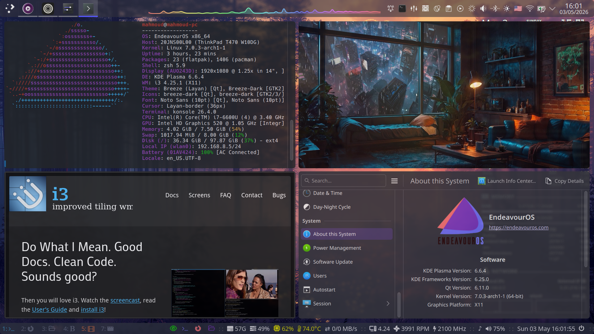
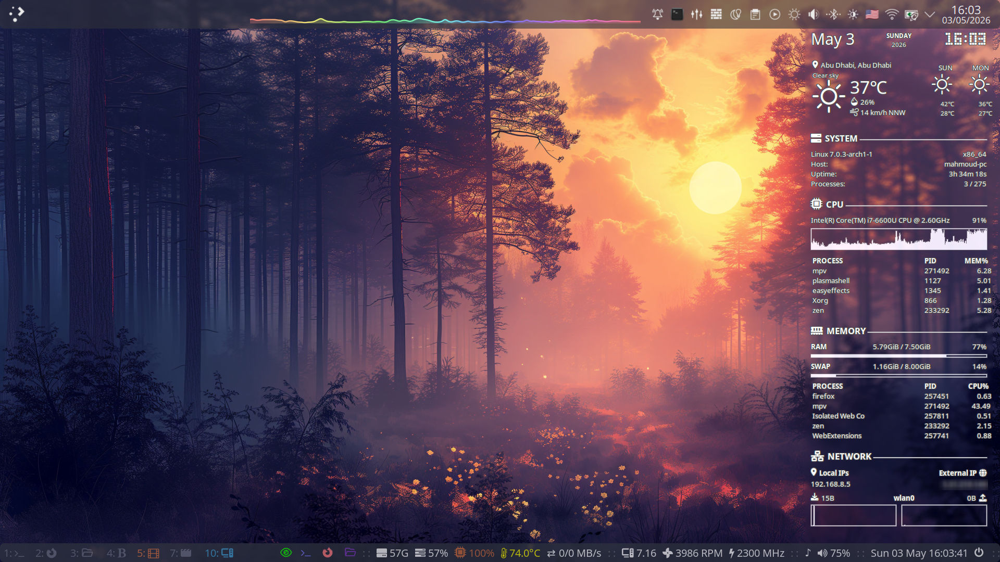
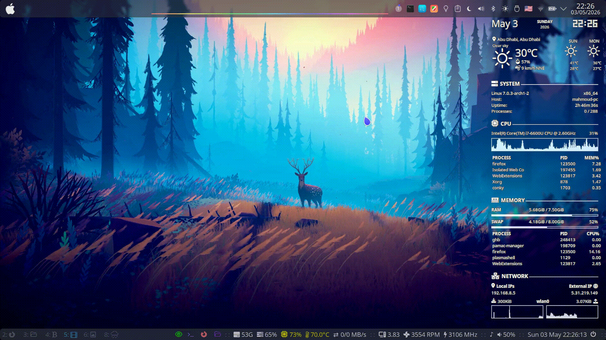
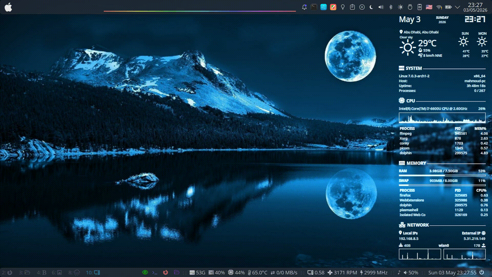

# i3 and KDE Plasma

<h3 align="center">The Best of Both Worlds</h3>
A comprehensive guide to integrating the i3 tiling window manager seamlessly into KDE Plasma. Get the ultimate tiling workflow without sacrificing KDE's out-of-the-box utilities.

---

> 
> 

---

## Why i3 and KDE Plasma?

* KDE Plasma is one of the most full-featured and beautiful desktop environments.
* i3wm is one of the lightest, most customizable, and simplest window managers.
* Together, we combine an easy, out-of-the-box desktop environment (***KDE Plasma***) with a lightweight, fully customizable tiling window manager (***i3wm***).

---

## Why use i3wm instead of a KWin script?

Short answer: **I3wm is better and more stable than any kwin script I tried**, and I would be happy for someone to prove me wrong.

---

## Pros & Cons

* **Pros** :
    * If you used KDE Plasma and i3wm before, you will love having them together.
    * Tiling support for KDE Plasma.
    * Most utilities and configurations, for example, (***GTK & QT theme, Display brightness buttons, Audio buttons, ...etc***) will work out of the box.

* **Cons**:
    * Not even one. “*At least for me*.”

---

## Table of Contents

1. **[Introduction](https://github.com/mysh264/i3-and-KDE-Plasma#i3-and-kde-plasma)**
    * [Why i3 and KDE Plasma?](https://github.com/mysh264/i3-and-KDE-Plasma#why-i3-and-kde-plasma)
    * [i3wm vs. KWin Scripts](http://github.com/mysh264/i3-and-KDE-Plasma#why-use-i3wm-instead-of-a-kwin-script)
    * [Pros & Cons](https://github.com/mysh264/i3-and-KDE-Plasma#pros--cons)


2. **[Installation & Setup](https://github.com/mysh264/i3-and-KDE-Plasma#installation)**
    * [Pre-installation State](https://github.com/mysh264/i3-and-KDE-Plasma#situation-before-the-installation)
    * [Clone This Repo (Recommended)](https://github.com/mysh264/i3-and-KDE-Plasma#clone-this-repo-prepared-for-kde-plasma--i3wm-recommended)
    * [EndeavourOS i3wm Base Setup](https://github.com/mysh264/i3-and-KDE-Plasma#or-clone-endeavouros-i3wm-setup)
    * [Packages (Required & Optional)](https://github.com/mysh264/i3-and-KDE-Plasma#packages)


3. **[Configuration](https://github.com/mysh264/i3-and-KDE-Plasma#configuration)**
    * [Replacing KWin with i3 (Systemd Service)](https://github.com/mysh264/i3-and-KDE-Plasma#replace-kwin-with-i3-using-systemd-user-service)
    * [Troubleshooting / Recovery]()
    * [i3 Config: Plasma Compatibility](https://github.com/mysh264/i3-and-KDE-Plasma#adding-stuff-to-the-i3-config)
    * [i3 Config: Cleanup & Optimization](https://github.com/mysh264/i3-and-KDE-Plasma#removing-stuff-from-the-i3-config)


4. **Desktop Fixes & Optimization**
    * [Keyboard Shortcut Conflicts](https://github.com/mysh264/i3-and-KDE-Plasma#disabling-a-shortcut-that-breaks-stuff)
    * [Plasma Logout Screen](https://github.com/mysh264/i3-and-KDE-Plasma#do-not-use-the-plasma-logout-screen)
    * [Splash Screen](https://github.com/mysh264/i3-and-KDE-Plasma#disable-the-kde-plasma-startup-screen-splash-screen)
    * [Fixing Mouse Cursors (System & Flatpak)](https://github.com/mysh264/i3-and-KDE-Plasma#fix-mouse-cursor)
    * [Fixing i3bar & Frame Fonts](https://github.com/mysh264/i3-and-KDE-Plasma#fix-fonts-i3bar--i3-frame)
    * [Redshift & Geoclue Fix](https://github.com/mysh264/i3-and-KDE-Plasma#redshift-fix-geoclue)


5. **Workflow Enhancements**
    * [Toggle/Hide Plasma Panel Script](https://github.com/mysh264/i3-and-KDE-Plasma#toggle-hide-plasma-panel)
    * [Random Wallpapers (Feh)](https://github.com/mysh264/i3-and-KDE-Plasma#random-wallpapers-feh)
    * [Picom](https://github.com/mysh264/i3-and-KDE-Plasma#picom)
    * [i3blocks](https://github.com/mysh264/i3-and-KDE-Plasma#i3blocks)
    * [Rofi](https://github.com/mysh264/i3-and-KDE-Plasma#rofi-application-launcher-theme)


6. **[System Customization](https://github.com/mysh264/i3-and-KDE-Plasma#system-customization)**
    * [Shell (ZSH & Oh My Zsh)](https://github.com/mysh264/i3-and-KDE-Plasma#shell)
    * Themes
        * [KDE Themes](https://github.com/mysh264/i3-and-KDE-Plasma#kde-themes)
        * [Icons](https://github.com/mysh264/i3-and-KDE-Plasma#icons)
        * [Mouse Cursor Themes](https://github.com/mysh264/i3-and-KDE-Plasma#mouse-cursor-themes)
    * [Conky Setup](https://github.com/mysh264/i3-and-KDE-Plasma#conky)
    * [Grub](https://github.com/mysh264/i3-and-KDE-Plasma#grub-theme)
    * [Plymouth](https://github.com/mysh264/i3-and-KDE-Plasma#plymouth)
    * [Easy Effects Audio Presets](https://github.com/mysh264/i3-and-KDE-Plasma#easy-effects-presets)


7. **[App Recommendations](https://github.com/mysh264/i3-and-KDE-Plasma#app-recommendations)**
    * [Terminals](https://github.com/mysh264/i3-and-KDE-Plasma#terminals)
    * [Web Browsers](https://github.com/mysh264/i3-and-KDE-Plasma#web-browsers)
    * [Email Clients](https://github.com/mysh264/i3-and-KDE-Plasma#email-clients)
    * [Editors](https://github.com/mysh264/i3-and-KDE-Plasma#editors)
    * [Downloader](https://github.com/mysh264/i3-and-KDE-Plasma#downloader)
    * [Torrent](https://github.com/mysh264/i3-and-KDE-Plasma#torrent-downloaders)
    * [Multimedia & Creative](https://github.com/mysh264/i3-and-KDE-Plasma#multimedia-tools)
    * [Screenshot & Recording](https://github.com/mysh264/i3-and-KDE-Plasma#screen-recorder-tools)
    * [Disk Utilities](https://github.com/mysh264/i3-and-KDE-Plasma#disk-utilities)
    * [Password Managers](https://github.com/mysh264/i3-and-KDE-Plasma#password-managers)
    * [Network](https://github.com/mysh264/i3-and-KDE-Plasma#network)
    * [Communication & Productivity](https://github.com/mysh264/i3-and-KDE-Plasma#communication-and-productivity)


---

## Installation

### Situation before the installation

* EndeavourOS KDE Edition, all updates installed
* KDE Plasma (X11)
* KWin

---

### Clone This Repo *"Prepared for KDE Plasma + i3wm"* *Recommended*

#### [mysh264/i3-and-KDE-Plasma/etc/skel/](https://github.com/mysh264/i3-and-KDE-Plasma/tree/main/etc/skel)

```bash
git clone https://github.com/mysh264/i3-and-KDE-Plasma.git
cd i3-and-KDE-Plasma
cp -dvr etc/skel/. $HOME
```

##### Tree Map ```i3-and-KDE-Plasma/etc/skel/```
<details>
  <summary>Click to expand!</summary>

```tree
.
├── .config
│   ├── conky
│   │   └── *lean-conky-config-0.9.0 # https://github.com/mysh264/i3-and-KDE-Plasma#conky
│   │       ├── *conky.conf # "Edited to work for Plasma + i3wm"
│   ├── i3
│   │   ├── *config # Edited to run with Plasma + i3wm
│   │   ├── *i3blocks.conf # "Edited to run scripts-2/plasma_panel_i3blocks.sh + ... etc"
│   │   ├── scripts # EndeavourOS scripts.
│   │   └── *scripts-2
│   │       ├── *fehbg.sh # "Random wallpapers (Feh)" # https://github.com/mysh264/i3-and-KDE-Plasma#random-wallpapers-feh
│   │       ├── *plasma_panel_i3blocks.sh "Plasma Panel status" # https://github.com/mysh264/i3-and-KDE-Plasma#toggle-hide-plasma-panel
│   │       └── *plasma_panel.sh "Toggle Plasma Panel" # https://github.com/mysh264/i3-and-KDE-Plasma#toggle-hide-plasma-panel
│   ├── nano
│   │   └── nanorc
│   ├── picom
│   │   └── *picom.conf "Edited to run Smoothly"
│   ├── rofi
│   │   ├── config.rasi
│   │   ├── powermenu.rasi
│   │   ├── power-profiles.rasi
│   │   ├── rofidmenu.rasi
│   │   └── rofikeyhint.rasi
│   ├── systemd
│   │   └── user
│   │       └── *plasma-i3.service "Systemd service to run i3 inside kde plasma" # https://github.com/mysh264/i3-and-KDE-Plasma#configuration
│   └── viewnior
│       └── viewnior.conf
├── .icons
│   ├── default
│   │   └── *index.theme # https://github.com/mysh264/i3-and-KDE-Plasma#fix-mouse-cursor
│   ├── Layan-border-cursors # https://github.com/mysh264/i3-and-KDE-Plasma#mouse-cursor-theme
│   └── material_cursors # https://github.com/mysh264/i3-and-KDE-Plasma#mouse-cursor-theme
├── .local
│   └── share
│       ├── applications
│       │   └── *kitty-yt-x.desktop # https://github.com/kovidgoyal/kitty & https://github.com/Benexl/yt-x
│       ├── *easyeffects # https://github.com/mysh264/i3-and-KDE-Plasma#easy-effects-presets
│       │   └── output
│       │       ├── GentleDynamics Dialogue Clarity Engine.json
│       │       ├── GentleDynamics Feather Loudness.json
│       │       └── GentleDynamics.json
│       └── rofi
│           └── themes
│               ├── arc_dark_colors.rasi
│               ├── arc_dark_transparent_colors.rasi
│               └── deep-purple.rasi
├── .Xresources # https://github.com/mysh264/i3-and-KDE-Plasma#fix-fonts-i3bar--i3-frame
└── .zshrc # https://github.com/mysh264/i3-and-KDE-Plasma#shell
```
</details>

---

### Or Clone [EndeavourOS i3wm Setup](https://github.com/endeavouros-team/endeavouros-i3wm-setup)

#### [endeavouros-team/endeavouros-i3wm-setup/etc/skel/](https://github.com/endeavouros-team/endeavouros-i3wm-setup/tree/main/etc/skel)

```bash
git clone https://github.com/endeavouros-team/endeavouros-i3wm-setup.git
cd endeavouros-i3wm-setup/etc/skel/
```

##### Tree Map ```endeavouros-i3wm-setup/etc/skel/```
<details>
  <summary>Click to expand!</summary>

```tree
.
├── .config
│   ├── autostart
│   │   └── firewall-applet.desktop
│   ├── dunst
│   │   └── dunstrc
│   ├── example.picom.conf
│   ├── gtk-3.0
│   │   ├── gtk.css
│   │   └── settings.ini
│   ├── gtk-4.0
│   │   └── settings.ini
│   ├── i3
│   │   ├── config
│   │   ├── i3blocks.conf
│   │   ├── keybindings
│   │   └── scripts
│   │       ├── audio-device-switch
│   │       ├── bandwidth2
│   │       ├── battery
│   │       ├── battery-pinebook-pro
│   │       ├── blur-lock
│   │       ├── cputemp
│   │       ├── cpu_usage
│   │       ├── disk
│   │       ├── empty_workspace
│   │       ├── gputemp
│   │       ├── import-gsettings
│   │       ├── keyhint
│   │       ├── keyhint-2
│   │       ├── memory
│   │       ├── openweather
│   │       ├── powermenu
│   │       ├── power-profiles
│   │       ├── ppd-status
│   │       ├── temperature
│   │       ├── volume
│   │       ├── volume_brightness2.sh
│   │       ├── volume_brightness.sh
│   │       └── vpn
│   ├── nano
│   │   └── nanorc
│   ├── nwg-look
│   │   └── config
│   ├── rofi
│   │   ├── config.rasi
│   │   ├── powermenu.rasi
│   │   ├── power-profiles.rasi
│   │   ├── rofidmenu.rasi
│   │   └── rofikeyhint.rasi
│   ├── xfce4
│   │   └── xfconf
│   │       └── xfce-perchannel-xml
│   │           └── xfce4-terminal.xml
│   └── xsettingsd
│       └── xsettingsd.conf
├── .gtkrc-2.0
├── .icons
│   └── default
│       └── index.theme
├── .local
│   └── share
│       ├── nwg-look
│       │   └── gsettings
│       └── rofi
│           └── themes
│               ├── arc_dark_colors.rasi
│               ├── arc_dark_transparent_colors.rasi
│               └── deep-purple.rasi
├── .profile
├── set_once.sh
├── tree.txt
├── xed.dconf
└── .Xresources
```
</details>

---

### Packages

We're gonna install a couple of packages that are required or nice-to-haves on i3, as well as i3 itself. This consists of:

* ```i3``` , [the window manager itself](https://i3wm.org/)
* ```i3blocks``` , [for i3bar status line](https://github.com/vivien/i3blocks)
* ```picom``` , [compositor](https://github.com/yshui/picom) (kwin replacement)
* ```feh``` , [to set up the background](https://github.com/derf/feh)
* ```rofi``` , [application launcher](https://github.com/davatorium/rofi) (dmenu replacement)
* ```wmctrl``` , [to get some info for the i3 config](https://github.com/Conservatory/wmctrl) (if you're not on an English installation of Plasma)

*optional for i3wm*

* ```viewnior``` , My favorite [image viewer](https://github.com/hellosiyan/Viewnior) (gwenview alternative)
* ```conky``` , [light-weight system monitor](https://github.com/brndnmtthws/conky)
* ```redshift``` , Color temperature adjustment tool <sup>[Geoclue fix](https://github.com/mysh264/i3-and-KDE-Plasma#Redshift-fix-geoclue)</Sup>
* ```awesome-terminal-fonts otf-font-awesome``` , if you are using [awesome fonts](https://fontawesome.com/v4/cheatsheet/) , you will need it
* ```xfce4-terminal``` , [best drop-down terminal](https://docs.xfce.org/apps/xfce4-terminal/dropdown) (yakuake replacement)
* ```sysstat tk gnuplot``` , some i3blocks scripts need them

*optional for KDE Plasma Panel*

* ```xdotool xorg-xwininfo``` to hide plasma panel
* ```plasma-applet-window-buttons``` <sup>[Extra](https://archlinux.org/packages/extra/x86_64/plasma-applet-window-buttons/)</sup> , [This is a Plasma 6 applet that shows window buttons in your panels](https://github.com/moodyhunter/applet-window-buttons6)
* ```plasma6-applets-panel-spacer-extended``` <sup>[AUR](https://aur.archlinux.org/packages/plasma6-applets-panel-spacer-extended)</sup> , [Spacer with Mouse gestures for the KDE Plasma Panel](https://github.com/luisbocanegra/plasma-panel-spacer-extended)
* ```plasma6-applets-kurve```  <sup>[AUR](https://aur.archlinux.org/packages/plasma6-applets-kurve)</sup> , [Audio visualizer widget powered by CAVA for the KDE Plasma Desktop](https://github.com/luisbocanegra/kurve)

**Here's a one-liner on how I installed everything needed:**
```bash
sudo pacman -Syyu && sudo pacman -S i3 i3blocks picom feh rofi wmctrl
```

Another one for ***i3wm optional Packages***:
```bash
sudo pacman -S viewnior conky redshift awesome-terminal-fonts otf-font-awesome xfce4-terminal sysstat tk gnuplot
```

A third one for ***KDE Plasma panel optional Packages***:
```bash
sudo pacman -S xdotool xorg-xwininfo plasma-applet-window-buttons
```

```bash
yay -S plasma6-applets-panel-spacer-extended plasma6-applets-kurve
```

---

## Configuration

### Replace kwin with i3 using systemd user service

***Note1: For this method, you do not need to be the root user.***
***Note2: Changes made with this method only affect the current user.***

Create a new service file called plasma-i3.service in `$HOME/.config/systemd/user`.

```bash
mkdir -p $HOME/.config/systemd/user
```

```bash
cd $HOME/.config/systemd/user
```

```bash
nano plasma-i3.service
```

Write the following into `$HOME/.config/systemd/user/plasma-i3.service`:

```conf
[Unit]
Description=Launch Plasma with i3
Before=plasma-workspace.target

[Service]
ExecStart=/usr/bin/i3
Restart=on-failure

[Install]
WantedBy=plasma-workspace.target
```

Reload Systemd Daemon
```bash
systemctl --user daemon-reload
```

Mask `plasma-kwin_x11.service` by running
```bash
systemctl mask plasma-kwin_x11.service --user
```

Enable the plasma-i3 service by running
```bash
systemctl enable plasma-i3 --user
```

To go back to KWin, just unmask the `plasma-kwin_x11.service` and disable your `plasma-i3` service in the same way.
```bash
systemctl unmask plasma-kwin_x11.service --user
```
```bash
systemctl disable plasma-i3 --user
```

### Troubleshooting / Recovery

***if the service fails Press Ctrl+Alt+F3, log in, and run***

```bash
systemctl unmask plasma-kwin_x11.service --user
```

```bash
systemctl disable plasma-i3 --user
```

```bash
reboot
```
---


### Adding stuff to the i3 config

1. To improve compatibility with Plasma, add the following lines in your i3 config.

```conf
# Plasma compatibility improvements

for_window [window_role="pop-up"] floating enable
for_window [window_role="task_dialog"] floating enable
for_window [class="yakuake"] floating enable
for_window [class="systemsettings"] floating enable
for_window [class="plasmashell"] floating enable
for_window [class="Plasma"] floating enable, border none
for_window [title="plasma-desktop"] floating enable, border none
for_window [title="win7"] floating enable, border none
for_window [class="krunner"] floating enable, border none
for_window [class="Kmix"] floating enable, border none
for_window [class="Klipper"] floating enable, border none
for_window [class="Plasmoidviewer"] floating enable, border none
for_window [class="(?i)*nextcloud*"] floating disable


no_focus [class="plasmashell" window_type="notification"]


for_window [class="plasmashell" window_type="notification"] floating enable, border none, move absolute position center, move down 400px

# Killing the existing window that covers everything
for_window [title="^Desktop @ QRect.*"] kill, floating enable, border none
```

2. For the application launcher, you can still use the application launcher from Plasma Panel.

> <p align="center">"KDE Plasma application launcher"</p>

> 

Also, you can use `rofi` launcher. *Meta+E*

> <p align="center">"Rofi application launcher"</p>

> 

If you prefer to use `krunner`, this is the terminal command line to launch it, if you need it.
```bash
qdbus6 org.kde.krunner /App org.kde.krunner.App.display
```

---

### Removing stuff from the i3 config
1. **Startup apps**
* _KDE Plasma will handle the startup apps._ Remove any ```exec``` line that is used for auto startup in the i3 config file; also, do not use ```dex```, the only exception will be feh for wallpaper, picom and [conky](https://github.com/brndnmtthws/conky) <sup>[conky theme](https://github.com/jxai/lean-conky-config)</sup>.
```
exec --no-startup-id feh --bg-scale "/path/to/wallpaper"
```
More info about picom [down below](https://github.com/mysh264/i3-and-KDE-Plasma#picom).
```
exec --no-startup-id picom -b
```

2. **Notifications**

* _KDE Plasma will handle it out of the box._

3. **Keyboard Layout**

* _KDE Plasma will handle it out of the box._ Remove any shortcut for that from the i3wm config file.
* Or Keep it if you prefer.
* ```exec --no-startup-id setxkbmap -layout 'us,ara' -variant altgr-intl,qwerty -option 'grp:win_space_toggle'```

4. **Display brightness buttons integration**

* _KDE Plasma will handle it out of the box._ Remove any shortcut for that from the i3wm config file.

5. **Audio buttons integration**

* _KDE Plasma will handle it out of the box._ Remove any shortcut for that from the i3wm config file.

6. **Lock screen**

* _KDE Plasma will handle it out of the box._ Remove any shortcut for that from the i3wm config file.
* *Note: This is the terminal command line to lock the screen, if you need it.* ```loginctl lock-session```

7. **Tray applet**

* _KDE Plasma will handle it out of the box._
* *Note: Make sure to add ```tray_output none``` to your i3 bar { } section in your i3 config file.*

---

### Disabling a shortcut that breaks stuff

#### Meta+Q "*Kill apps*"
Launch the Plasma System Settings and go to *Keyboard > Shortcuts > Category System Services > Plasma Workspace* and disable the shortcut "Activities..." that uses the combination ```Meta+Q```.

> <p align="center">"Screenshot of Activities Shortcut Settings"</p>

> 

#### Meta+R "*Resize*"
Launch the Plasma System Settings and go to *Category Workspace > Shortcuts > Category Applications > Spectacle* and disable the shortcut "Start/Stop Region Recording" that uses the combination ```Meta+R```.

> <p align="center">"Screenshot of Spectacle Shortcut Settings"</p>

> 

---

### Do not use the plasma logout screen
Rofi will handle it, if you are using my configuration files or [EndeavourOS i3wm Edition configuration files (github)](https://github.com/endeavouros-team/endeavouros-i3wm-setup) , Just press ```Super+Shift+E```

```
# exit-menu
bindsym Mod4+Shift+e exec --no-startup-id ~/.config/i3/scripts/powermenu
```

> <p align="center">"Rofi exit menu"</p>

> 

---

### Disable the KDE Plasma startup screen "*Splash Screen*"
Launch the Plasma System Settings and go to *Colors & Themes > Splash Screen* and disable it.

> <p align="center">"Screenshot of Splash Screen Settings"</p>

> 

-----

### Fix mouse cursor

When changing the mouse cursor theme or size, some apps may display a different cursor.
In my case, I used [Layan border cursors](https://github.com/vinceliuice/Layan-cursors) <sup>[KDE Store](https://store.kde.org/p/1365214)</sup> and changed the size to 36.

To fix it, create the `$HOME/.icons/default` directory. ***If it doesn't exist.***

```bash
mkdir -p $HOME/.icons/default
```

Then edit/create a new file called `index.theme`

```bash
nano $HOME/.icons/default/index.theme
```

Write the following into `index.theme`

```conf
[Icon Theme]
Name=layan-border-cursors
Size=36
```

#### For Flatpak apps, the problem is still the same; to fix it you need to give read access to ```/usr/share/icons/``` ```/home/$USER/.icons/``` ```/.local/share/icons/``` <sup>[Arch Wiki](https://wiki.archlinux.org/title/Flatpak#Applications_do_not_use_the_correct_cursor_theme)</sup>

```bash
flatpak -u override --filesystem=/usr/share/icons/:ro
```

```bash
flatpak -u override --filesystem=/home/$USER/.icons/:ro
```

```bash
flatpak --user override --filesystem=~/.local/share/icons/:ro
```

```bash
flatpak -u override --filesystem=xdg-config/gtk-3.0:ro
```

---

### Fix Fonts (**i3bar & i3-frame**)
When you restart the system, the i3bar uses a different font. Restarting i3 in place using ```Super+Shift+R``` solves it.
I know this is frustrating, so here is another workaround/solution.

Create a new file called `.Xresources` in your $HOME

```bash
nano $HOME/.Xresources
```

Write the following into `.Xresources`

```conf
Xft.antialias: 1
Xft.hinting: 1
Xft.hintstyle: hintslight
Xft.rgba: rgb
```

Then run this to load parameters from your configuration file `.Xresources` during your X Session.

```bash
xrdb -merge ~/.Xresources
```
To check run

```bash
xrdb -query -all
```

Finally, add these lines to your i3 config file to load the parameters and restart i3 at the start up.

``` conf
# Load ~/.Xresources
exec --no-startup-id xrdb -merge ~/.Xresources

# Restart i3wm
no-startup-id sleep 2 && i3-msg restart
```

---

### Redshift fix *(geoclue)*

If you tried to run redshift, the first thing you will notice is it can't locate your location, all that is required is **start Geoclue Demo agent.**

```bash
/usr/lib/geoclue-2.0/demos/agent &
```

*check if GeoClue works properly*

```bash
/usr/lib/geoclue-2.0/demos/where-am-i
```

```bash
systemctl status geoclue.service
```

---

### Toggle Hide Plasma Panel

i3wm does not support auto hide or toggle for plasma panel, and most of the time I don't use it, so I made a script using ```xdotool``` and ```xorg-xwininfo``` to work around this using ```Mod4+U``` to toggle plasma panel.



***Note1: This script works perfectly if the Plasma panel is at the top of the screen, if you prefer to have the panel down, please check out the script before running it.***

***Note2: This script needs to be run at the startup, But we will not do that, just run the script once, and it will move the mouse cursor to the top edge of the screen, then it will give a unique name for the panel, so you can hide it or unhide it only, nothing else.***

***Note3: Plasma panel shares the classname [plasmashell] with other utilities "Like plasma notification" the only way to make it unique is to give it a name***

1. Copy scripts-2 folder to i3 config directory

```bash
git clone https://github.com/mysh264/i3-and-KDE-Plasma.git
```

```bash
cd i3-and-KDE-Plasma
```

```bash
cp -dvr etc/skel/.config/i3/scripts-2/ $HOME/.config/i3/
```

2. Install ```xdotool``` and ```xorg-xwininfo``` to run the scripts

```bash
sudo pacman -S xdotool xorg-xwininfo
```

3. Add this line to your i3 config file ```Super+U```

```conf
# Toggle plasma panel
bindsym Mod4+u exec --no-startup-id ~/.config/i3/scripts-2/plasma_panel.sh && pkill -RTMIN+2 i3blocks
```

4. Edit i3blocks.conf and add this lines

```bash
nano $HOME/.config/i3/i3blocks.conf
```

```
[plasma-panel]
label=
command=~/.config/i3/scripts-2/plasma_panel_i3blocks.sh
interval=once
signal=2
```

<details>
  <summary>Click to view plasma_panel.sh</summary>

```sh

#!/bin/bash

name=Togglehidepanelplasma

# xwininfo reply (xorg-xwininfo)
hide=IsUnMapped
unhide=IsViewable

# Check if plasma panel name is set
if xwininfo -name $name ; then
    echo " All set"
else
    #xdotool selectwindow set_window --name "$name"
    ## Auto select the panel by mouse
    xdotool mousemove 500 15 ; xdotool selectwindow set_window --name "$name" & sleep 0.2 ;  xdotool click 1
fi

# Current panel status
status=$(xwininfo -name $name | grep 'Map State' | awk '{print $3}')

# Toggle the panel

## if the panel is hidden then show it
if [ $status == $hide ] ; then

    if xdotool search -all --class "plasmashell" search --name "^$name"  windowmap ; then
        echo "Plasma Panel is unhidden now"
    fi
else

## is the panel is not hidden then hide it.
    if [ $status == $unhide ] ; then
        if xdotool search -all --class "plasmashell" search --name "^$name"  windowunmap ; then
            echo "Plasma Panel is hidden now"
            fi
        fi

fi

```
</details>


<details>
  <summary>Click to view plasma_panel_i3blocks.sh</summary>

```sh

#!/bin/bash

## I3blocks colours
# https://unix.stackexchange.com/questions/583409/i3blocks-script-coloring

name=Togglehidepanelplasma

# xwininfo reply (xorg-xwininfo)
hide=IsUnMapped
unhide=IsViewable

# Current panel status
status=$(xwininfo -name $name | grep 'Map State' | awk '{print $3}')

# Check if plasma panel name is set
if xwininfo -name $name &> /dev/null ; then
    if [ $status == $hide ] ; then
        #echo " "
        echo
        #echo \#961c90

    else
        if [ $status == $unhide ] ; then
            echo " "
            echo
            echo \#15ff00
        fi
    fi

else
    echo "  Plasma Panel"
    echo
    echo  \#c20707
fi

```
</details>


---

### Random wallpapers (Feh)



1. Copy scripts-2 folder to i3 config directory

```bash
git clone https://github.com/mysh264/i3-and-KDE-Plasma.git
cd i3-and-KDE-Plasma
cp -dvr etc/skel/.config/i3/scripts-2/ $HOME/.config/i3/
```

2. Make Wallpaper directory ```$HOME/.Wallpapers``` , ***Note: This directory will be used for feh script, move/ln/copy your wallpapers folders/Images to this folder***

```
mkdir ~/.Wallpapers
```

2. Add this line to your i3 config file to startup the scripts ```fehbg.sh```

```
exec --no-startup-id ~/.config/i3/scripts-2/fehbg.sh -t 300 # -t means sleep time (300 = 5 min)
```

<details>
  <summary>Click to view fehbg.sh</summary>

```sh
#!/bin/bash

walldir=$HOME/.Wallpapers/*
app=feh
scale=--bg-fill
options="--randomize --recursive"

# Default values
SLEEP_TIME=300 # 5 min

# ':' after a letter means that option requires an argument
while getopts "t:" opt; do
  case $opt in
    t)
      SLEEP_TIME=$OPTARG
      ;;
    \?)
      echo "Invalid option: -$OPTARG" >&2
      exit 1
      ;;
  esac
done

while $app $options $scale $walldir;
do sleep $SLEEP_TIME;
done
```
</details>

---

### Picom

Coming Soon: Check my config here [picom.conf](etc/skel/.config/picom/picom.conf)

https://wiki.archlinux.org/title/Picom

<!-- Section coming soon -->

---

### I3blocks

Coming Soon: Check my config here [i3block.conf](etc/skel/.config/i3/i3blocks.conf)

* [scripts "EndeavourOS"](etc/skel/.config/i3/scripts)
* [scripts-2](etc/skel/.config/i3/scripts-2)

https://github.com/vivien/i3blocks

<!-- Section coming soon -->

---

### Rofi *"Application Launcher"* Theme

1. Copy ```.config/rofi``` & ```.local/share/rofi``` to their respective locations in $HOME.

```bash
git clone https://github.com/mysh264/i3-and-KDE-Plasma.git
cd i3-and-KDE-Plasma
cp -dvr etc/skel/.config/rofi $HOME/.config/
cp -dvr etc/skel/.local/share/rofi $HOME/.local/share/
```


---


## System Customization

### Shell

#### 1. Using ZSH instead of Bash, + OH MY ZSH

* ```zsh``` , A very advanced and programmable command interpreter (shell) for UNIX.

* ```zsh-autosuggestions``` , Brings Fish-shell autosuggestions to ZSH.

* ```zsh-history-substring-search``` , ZSH port of Fish history search (up arrow).

* ```zsh-syntax-highlighting``` , Fish-shell-like syntax highlighting for Zsh.
* ```oh-my-zsh-git``` <sup>[Github](https://github.com/ohmyzsh/ohmyzsh)</sup> <sup>[AUR](http://aur.archlinux.org/packages/oh-my-zsh-git)</sup> , A community-driven framework for managing your zsh configuration. Includes 180+ optional plugins and over 120 themes to spice up your morning, and an auto-update tool so that makes it easy to keep up with the latest updates from the community.

``````bash
sudo pacman -S zsh zsh-autosuggestions zsh-history-substring-search zsh-syntax-highlighting
``````

```bash
yay -S oh-my-zsh-git
```

#### 2. Change user shell to ZSH

```bash
chsh -s $(which zsh)
```

#### 3. Edit ZSH config file.

```bash
nano .zshrc
```

Change ```ZSH_THEME=``` to [Bira](https://github.com/ohmyzsh/ohmyzsh/wiki/Themes#bira)

```conf
ZSH_THEME="bira"
```

Enable ```zsh-autosuggestions``` , ```zsh-history-substring-search``` , & ```zsh-syntax-highlighting``` , 

Add these lines to the very end of the file:

```conf
source /usr/share/zsh/plugins/zsh-autosuggestions/zsh-autosuggestions.zsh
source /usr/share/zsh/plugins/zsh-syntax-highlighting/zsh-syntax-highlighting.zsh
source /usr/share/zsh/plugins/zsh-history-substring-search/zsh-history-substring-search.zsh
```

---

### KDE Themes

* [Layan kde](https://github.com/vinceliuice/Layan-kde) <sup>[AUR](http://aur.archlinux.org/packages/plasma6-themes-layan-git)</sup> , Layan kde is a flat Design theme for KDE Plasma desktop.

  ```bash
  yay -S plasma6-themes-layan-git
  ```

* [WhiteSur KDE Theme](https://github.com/vinceliuice/WhiteSur-kde) <sup>[AUR](http://aur.archlinux.org/packages/whitesur-kde-theme)</sup> , WhiteSur kde is a MacOS big sur like theme for KDE Plasma desktop.

  ```bash
  yay -S whitesur-kde-theme
  ```

---

### Icons

* [WhiteSur Icon Theme](https://github.com/vinceliuice/WhiteSur-icon-theme) <sup>[AUR](http://aur.archlinux.org/packages/whitesur-icon-theme)</sup> , MacOS Big Sur like icon theme for linux desktops.

  ```bash
  yay -S whitesur-icon-theme
  ```

---

### Mouse Cursor Themes

* [Layan border cursors](https://github.com/vinceliuice/Layan-cursors) <sup>[KDE Store](https://store.kde.org/p/1365214)</sup> , This is an x-cursor theme inspired by layan gtk theme and based on [capitaine-cursors](https://github.com/keeferrourke/capitaine-cursors).

* [Material Cursors](https://github.com/varlesh/material-cursors) <sup>[AUR](https://aur.archlinux.org/packages/material-cursors-git)</sup> <sup>[KDE Store](https://store.kde.org/p/1346778)</sup> , Material cursors with 3 color variants.

  ```bash
  yay -S material-cursors-git
  ```

---

### Conky

* [Lean Conky Config](https://github.com/jxai/lean-conky-config) , Lean Conky Config (LCC) is, well, a lean [Conky](https://github.com/brndnmtthws/conky/wiki) config that just works.

  


***Note: I edited conky.conf to make it work for plasma + i3wm***

```bash
git clone https://github.com/mysh264/i3-and-KDE-Plasma.git
```

```bash
cd i3-and-KDE-Plasma
```

```bash
cp -dvr etc/skel/.config/conky $HOME/.config/
```

Then add this line to your i3 config file to auto start conky.

```conf
exec --no-startup-id ~/.config/conky/lean-conky-config-0.9.0/start-lcc.sh
```

---

### Grub Theme

* [Distro Grub Themes](https://github.com/AdisonCavani/distro-grub-themes) <sup>[Themes](https://k1ng.dev/distro-grub-themes/preview)</sup> , A pack of GRUB2 themes for different Linux distributions and OSs.

* [Gorgeous-GRUB](https://github.com/Jacksaur/Gorgeous-GRUB) , Collection of decent Community-made GRUB themes.

* [Grub Customizer](https://launchpad.net/grub-customizer) <sup>[AUR](https://aur.archlinux.org/packages/grub-customizer)</sup> , A graphical grub2 settings manager.

  ```bash
  yay -S grub-customizer
  ```

---


### Plymouth

* https://wiki.archlinux.org/title/Plymouth

<!-- Section coming soon -->

---

### Easy Effects Presets

* [GentleDynamics](https://github.com/droidwayin/GentleDynamics)
  * [GentleDynamics Dialogue Clarity Engine (Movie Preset)](https://github.com/droidwayin/GentleDynamics#-gentledynamics-dialogue-clarity-engine-movie-preset-%EF%B8%8F) , This preset employs surgical compression techniques to solve the common  problem of fluctuating dialogue levels in modern movies without using  AutoGain. This preset ensures the dialogue is always clear, while  respecting the dynamics and impact of the original soundtrack. You get  consistent, ***intelligible speech***.
  * [GentleDynamics Feather Loudness V4 (Gentler and Sweeter Preset for Music](https://github.com/droidwayin/GentleDynamics#-gentledynamics-feather-loudness-v4-gentler-and-sweeter-preset-for-music-%EF%B8%8F%E2%80%8D) , This EasyEffects preset based on psychoacoustic principles to enhance  your music listening experience. It features an 8-band multiband  compressor (MBC) aligned with human hearing (Bark scale) for natural  sound improvement on both headphones and speakers.

* [Autoeq](https://www.autoeq.app/) , AutoEq is a tool for automatically equalizing headphones.

---

## App Recommendations

### Terminals

<details><summary>Click to view</summary>

* ```kitty``` , The fast, feature-rich, [GPU based terminal emulator](https://sw.kovidgoyal.net/kitty/).

  ```bash
  sudo pacman -S kitty
  ```
</details>
---

### Web Browsers

<details><summary>Click to view</summary>

* ```brave``` <sup>[AUR](http://aur.archlinux.org/packages/brave-bin)</sup> , Web browser that blocks ads and trackers by default.

  ```bash
  yay -S brave-bin
  ```

* ```zen``` <sup>[Flatpak](http://flathub.org/en/apps/app.zen_browser.zen)</sup> <sup>[AUR](http://aur.archlinux.org/packages/zen-browser-bin)</sup> , [A fast, private and secure web browser built to improve your day-to-day experience.](https://zen-browser.app/)

  ```bash
  flatpak install flathub app.zen_browser.zen
  
  yay -S zen-browser-bin
  ```
</details>

---

### Email Clients

<details><summary>Click to view</summary>

* ```thunderbird thunderbird-i18n-en-us thunderbird-i18n-ar hunspell-en_us hunspell-ar``` , Thunderbird is **a free email application** that’s easy to set up and customize - and it’s loaded with great features!

  ```bash
  sudo pacman -S thunderbird thunderbird-i18n-en-us thunderbird-i18n-ar hunspell-en_us hunspell-ar
  ```

* ```birdtray``` <sup>[AUR](http://aur.archlinux.org/packages/birdtray)</sup> , Run Thunderbird with a system tray icon.

  ```bash
  yay -S birdtray
  ```
</details>

---

### Editors

<details><summary>Click to view</summary>

* ```github-desktop``` <sup>[Flatpak](https://flathub.org/en/apps/io.github.shiftey.Desktop)</sup> , GUI for managing Git and GitHub.

  ```bash
  flatpak install flathub io.github.shiftey.Desktop
  ```

* ```typora``` <sup>[AUR](http://aur.archlinux.org/packages/typora)</sup> , [A minimal markdown editor and reader.](https://typora.io/)

  ```bash
  yay -S typora
  ```

* ```zed``` <sup>[Flatpak](https://flathub.org/en/apps/dev.zed.Zed)</sup> , High-performance code editor.

  ```bash
  flatpak install flathub dev.zed.Zed
  ```

* ```meld``` , Compare files, directories and working copies.

  ```bash
  sudo pacman -S meld
  ```
</details>

---

### Downloader

<details><summary>Click to view</summary>

* ```jdownloader2``` <sup>[AUR](http://aur.archlinux.org/packages/jdownloader2)</sup> , Download manager, written in Java, for one-click hosting sites like Rapidshare and MEGA.

  ```bash
  yay -S jdownloader2
  ```
</details>

---

### Torrent Downloaders

<details><summary>Click to view</summary>

* ```qbittorrent``` , An open source Bittorrent client.

  ```bash
  sudo pacman -S qbittorrent
  ```
</details>

---

### Multimedia Tools

<details><summary>Click to view</summary>

* ```easyeffects``` , [Audio Effects for Pipewire applications.](https://github.com/wwmm/easyeffects)

  ```bash
  sudo pacman -S easyeffects
  ```

* ```mpv-mpris2-bin```<sup>[AUR](http://aur.archlinux.org/packages/mpv-mpris2-bin)</sup> , Rust implementation of the MPRIS v2 DBus interface for the mpv.

  ```bash
  sudo pacman -S playerctl ffmpegthumbnailer
  
  yay -S mpv-mpris2-bin
  ```

* ```stremio``` <sup>[Flatpak](https://flathub.org/en/apps/com.stremio.Stremio)</sup> , [A one-stop hub for video content aggregation (Movies, TV shows, series, live television or web channels)](https://www.stremio.com/)

  ```bash
  flatpak install flathub com.stremio.Stremio
  ```

* ```yt-x``` <sup>[AUR](http://aur.archlinux.org/packages/yt-x)</sup> <sup>[Github](https://github.com/Benexl/yt-x)</sup> , Browse YouTube from your terminal. Plus other sites yt-dlp supports.

  ***Note: Use ```yt-x``` with ```kitty```***

  ```bash
  yay -S yt-x
  ```

* ```video-trimmer``` , Trim videos quickly.

  ```bash
  sudo pacman -S video-trimmer
  ```

* ```handbrake``` , Video Transcoder.

  ```bash
  sudo pacman -S handbrake
  ```
</details>

---

### Screenshot & Screen Recorder Tools

<details><summary>Click to view</summary>

* ```maim``` , Utility to take a screenshot using imlib2.

  ```bash
  sudo pacman -S maim slop
  ```

* ```obs-studio``` , Free, open source software for live streaming and recording.

  ```bash
  sudo pacman -S obs-studio
  ```
</details>

---

### Disk Utilities

<details><summary>Click to view</summary>

* ```ventoy``` <sup>[AUR](http://aur.archlinux.org/packages/ventoy-bin)</sup> , [A new bootable USB solution](http://www.ventoy.net)

  ```bash
  yay -S ventoy-bin
  ```

* ```gparted``` , A Partition Magic clone, frontend to GNU Parted.

  ```bash
  sudo pacman -S gparted
  ```

* ```gnome-disk-utility``` , Disk Management Utility for GNOME.

  ```bash
  sudo pacman -S gnome-disk-utility
  ```
</details>

---

### Password Managers

<details><summary>Click to view</summary>

* ```enpass``` <sup>[AUR](http://aur.archlinux.org/packages/enpass-bin)</sup> , [A multiplatform password manager](http://enpass.io/)

  ```bash
  yay -S enpass-bin
  ```
</details>

---

### Network

<details><summary>Click to view</summary>

* ```sniffnet``` , Application to comfortably monitor your network traffic

  ```bash
  sudo pacman -S sniffnet
  ```
</details>

---

### Communication and Productivity

<details><summary>Click to view</summary>

* ```portal for teams``` <sup>[Flatpak](https://flathub.org/en/apps/com.github.IsmaelMartinez.teams_for_linux)</sup> , Unofficial Microsoft Teams client for Linux.

  ```bash
  flatpak install flathub com.github.IsmaelMartinez.teams_for_linux
  ```

* ```teams-for-linux``` <sup>[AUR](https://aur.archlinux.org/packages/teams-for-linux)</sup> , Unofficial Microsoft Teams client for Linux using Electron.

  ```bash
  yay -S teams-for-linux
  ```
</details>

---


