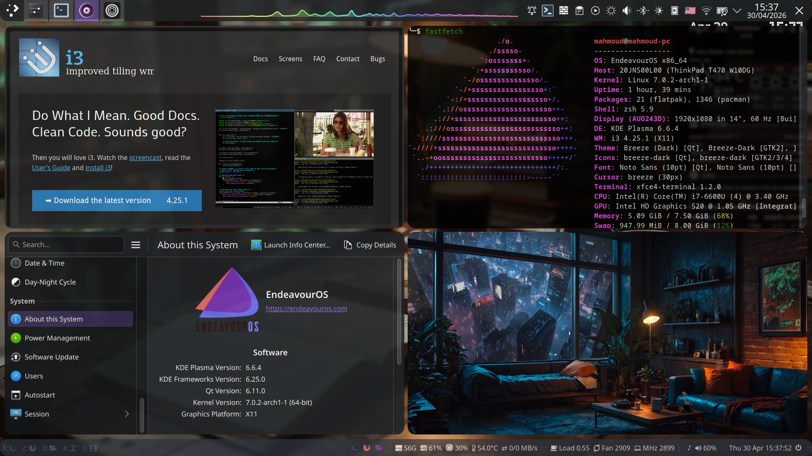
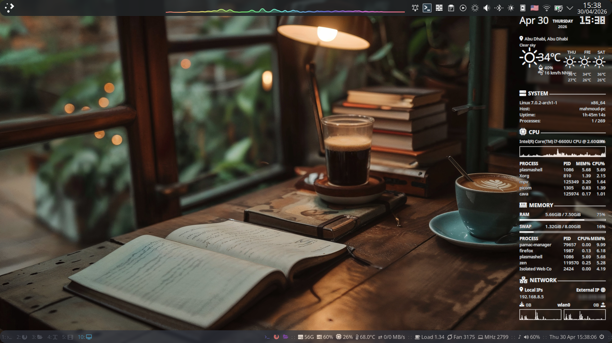
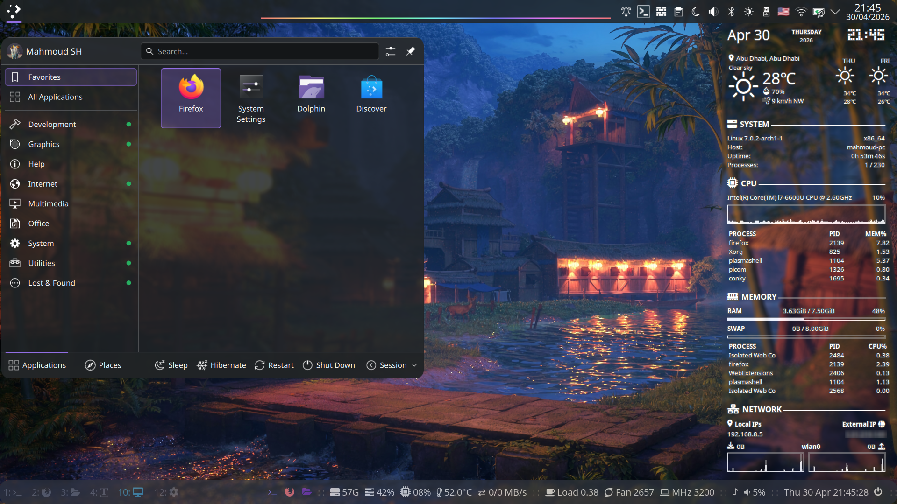
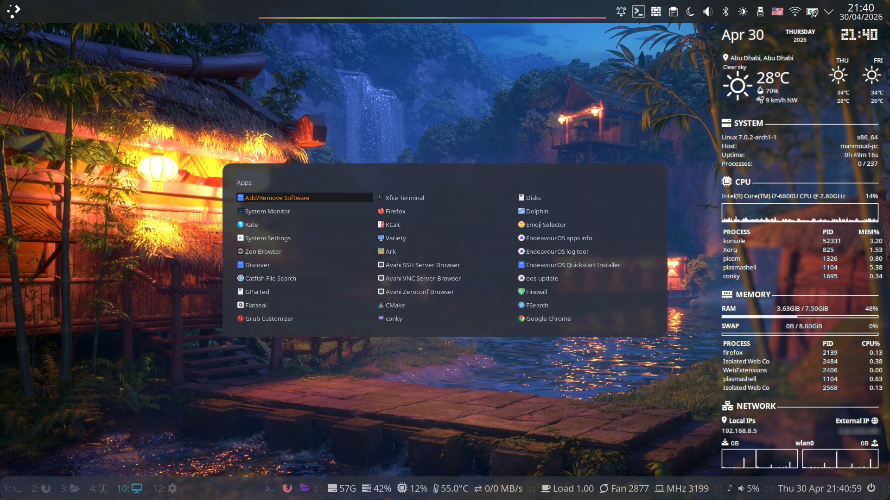
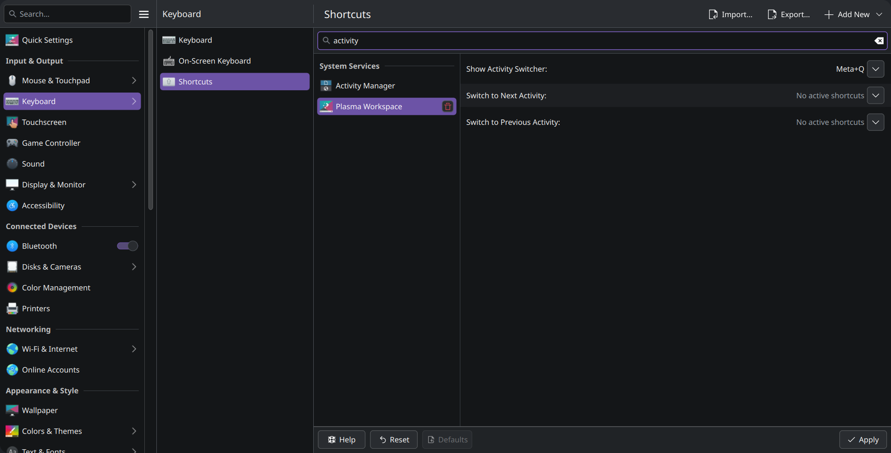
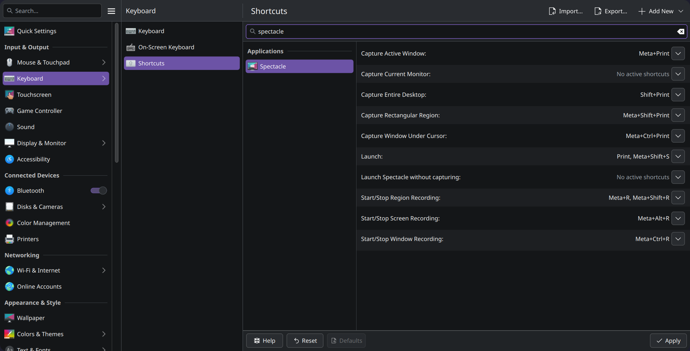
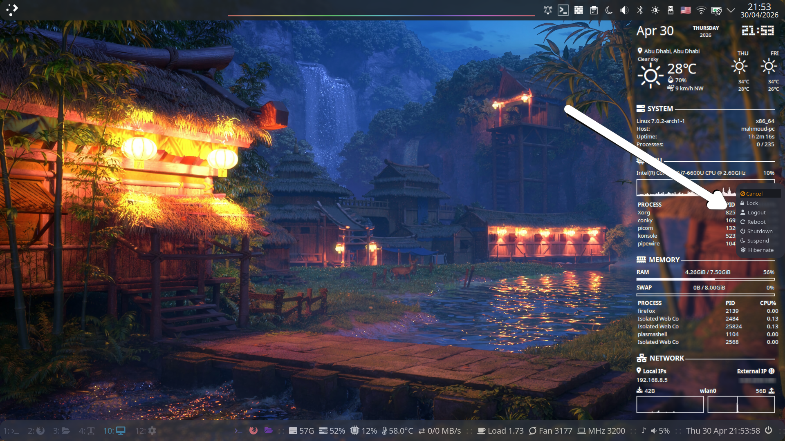
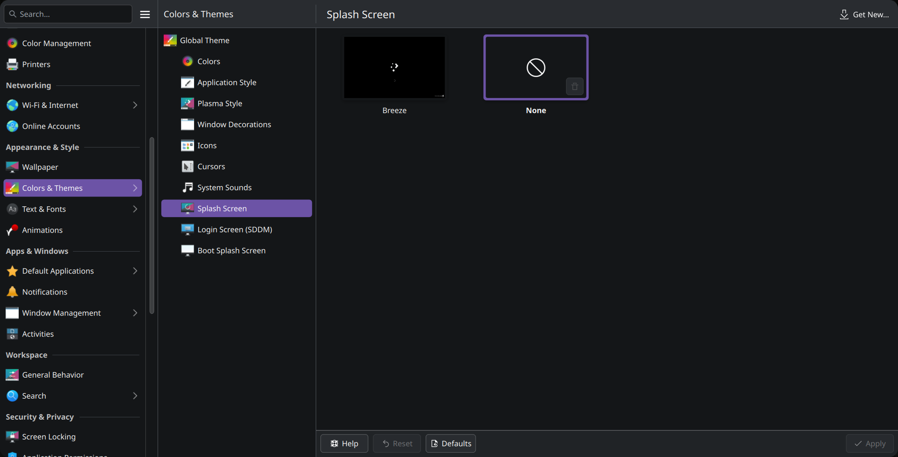

# i3 and KDE Plasma

<h3 align="center">The Best of Both Worlds</h3>
A comprehensive guide to integrating the i3 tiling window manager seamlessly into KDE Plasma. Get the ultimate tiling workflow without sacrificing KDE's out-of-the-box utilities.

---

> 
> 

---

## Why i3 and KDE Plasma?

* KDE Plasma is one of the most full-featured and beautiful desktop environments.
* i3wm is one of the lightest, most customizable, and simplest window managers.
* Together, we will have the easy, working out-of-the-box desktop environment (***KDE Plasma***) and tiling style, light, fully customizable window manager (***i3wm***).

---

## Why use i3wm instead of a KWin script?

Short answer: **I3wm is better and more stable than any kwin script I tried**, and I will be happy to prove me wrong.

---

## Pros & Cons

* **Pros** :
    * If you used KDE Plasma and i3wm before, you will love having them together.
    * Tiling support for KDE Plasma.
    * Most utilities and configurations, for example, (***GTK & QT theme, Display brightness buttons, Audio buttons, ...etc***) will work out of the box.

* **Cons**:
    * Not even one. “*At least for me*.”

---

## Situation before the installation

* EndeavourOS KDE Edition, all updates installed
* KDE Plasma (X11)
* KWin

---

## Setup Checklist

1. - [x] Install Packages.
2. - [ ] Clone this repository: ```git clone https://github.com/mysh264/i3-and-KDE-Plasma.git``` for i3, i3block, rofi, picom, conky
3. - [ ] Download [EndeavourOS i3wm Edition configuration files (github)](https://github.com/endeavouros-team/endeavouros-i3wm-setup), for rofi & i3block configuration files (also i3 & picom configuration files if you like).
4. - [ ] Merge the prepared rofi configuration files into (**$HOME/.local/share/rofi**) and (**$HOME/.config/rofi**)
5. - [ ] Merge the prepared i3blocks configuration files (**i3block.conf and Scripts Folder**) into (**$HOME/.config/i3/**)
6. - [ ] Modify picom (Download the one that I have, or use [EndeavourOS i3wm Edition configuration files (github)](https://github.com/endeavouros-team/endeavouros-i3wm-setup), or simply do it yourself as you prefer.)
7. - [x] Modify the i3wm config file in general (Download the one that I have, or use [EndeavourOS i3wm Edition configuration files (github)](https://github.com/endeavouros-team/endeavouros-i3wm-setup), or simply do it yourself as you prefer.)
    *  - [x] No need for any Bright or volume shortcut keys, **KDE will handle it.**
    *  - [x] No need for `dex`, **KDE will handle it.**
    *  - [x] No need for any Lock screen shortcut or configuration, **KDE will handle it.**
    *  - [x] `Feh` will take care of wallpaper; **Do not use KDE for wallpaper.**
    *  - [x] Exit Menu `rofi` will handle it. **Do not use KDE for that.**
8. - [x] Modify the i3wm config file for KDE Plasma 
9. - [x] Turn off some KDE shortcuts.
10. - [x] Turn off the startup screen.
11. - [x] Fix mouse cursor.
12. - [x] Fix flatpak mouse cursor.
13. - [x] Fix fonts (i3bar & i3 frame).
14. - [ ] [Conky](https://github.com/jxai/lean-conky-config)
15.    - [ ] [material-cursors](https://github.com/varlesh/material-cursors) <sup>[AUR](https://aur.archlinux.org/packages/material-cursors-git)</sup>, <sup>[KDE Store](https://store.kde.org/</sep>p/1346778)</sup>
16.    - [x] [Layan cursors](https://github.com/vinceliuice/Layan-cursors) <sup>[KDE Store](https://store.kde.org/p/1365214)</sup>
17. - [ ] Add URLs Sources. [1](https://userbase.kde.org/Tutorials/Using_Other_Window_Managers_with_Plasma) [2](https://github.com/heckelson/i3-and-kde-plasma) [3](https://github.com/avivace/dotfiles)
18.    - [x] Redshift. "use geoclue fix for url"
19.    - [ ] geoclue fix <sup>[Arch Wiki](https://wiki.archlinux.org/title/Redshift#Unable_to_connect_to_GeoClue)</sup> *"Auto start"*```/usr/lib/geoclue-2.0/demos/agent & ``` *"check if GeoClue works properly"* ```/usr/lib/geoclue-2.0/demos/where-am-i```

---

## Installation

### Packages

We're gonna install a couple of packages that are required or nice-to-haves on i3, as well as i3 itself. This consists of:

* ```i3```, [the window manager itself](https://i3wm.org/)
* ```i3blocks```, [for i3bar staus line](https://github.com/vivien/i3blocks)
* ```picom```, [compositor](https://github.com/yshui/picom) (kwin replacement)
* ```feh```, [to set up the background](https://github.com/derf/feh)
* ```rofi```, [application launcher](https://github.com/davatorium/rofi) (dmenu replacement)
* ```wmctrl```, [to get some info for the i3 config](https://github.com/Conservatory/wmctrl) (if you're not on an English installation of Plasma)

*optional for i3wm*

* ```viewnior```, my favourit [image viewer](https://github.com/hellosiyan/Viewnior) (gwenview alternative)
* ```conky```, [light-weight system monitor](https://github.com/brndnmtthws/conky)
* ```redshift```, Color temperature adjustment tool <sup>[Geoclue fix]()</Sup>
* ```awesome-terminal-fonts```, if you are using [awesome fonts](https://fontawesome.com/v4/cheatsheet/), you will need it
* ```xfce4-terminal```, [best drop-down terminal](https://docs.xfce.org/apps/xfce4-terminal/dropdown) (yakuake replacement)
* ```sysstat tk gnuplot```, some i3blocks scripts need them

*optional for KDE Plasma Panel*
* ```plasma-applet-window-buttons``` <sup>[Extra](https://archlinux.org/packages/extra/x86_64/plasma-applet-window-buttons/)</sup>, [This is a Plasma 6 applet that shows window buttons in your panels](https://github.com/moodyhunter/applet-window-buttons6)
* ```plasma6-applets-panel-spacer-extended``` <sup>[AUR](https://aur.archlinux.org/packages/plasma6-applets-panel-spacer-extended)</sup> , [Spacer with Mouse gestures for the KDE Plasma Panel](https://github.com/luisbocanegra/plasma-panel-spacer-extended)
* ```plasma6-applets-kurve```  <sup>[AUR](https://aur.archlinux.org/packages/plasma6-applets-kurve)</sup> , [Audio visualizer widget powered by CAVA for the KDE Plasma Desktop](https://github.com/luisbocanegra/kurve)

**Here's a one-liner on how I installed everything needed:**
```bash
sudo pacman -Syyu && sudo pacman -S i3 i3blocks picom feh rofi wmctrl
```

Another one for ***i3wm optional Packages***:
```bash
sudo pacman -S viewnior conky redshift awesome-terminal-fonts xfce4-terminal sysstat tk gnuplot
```

A third one for ***KDE Plasma panel optional Packages***:
```bash
sudo pacman -S plasma-applet-window-buttons
```

```bash
yay -S plasma6-applets-panel-spacer-extended plasma6-applets-kurve
```

---

## Configuration

Replace kwin with i3 using systemd user service

Note that for this method, you do not need to be the root user. However, that means the changes will not affect the other users.

Create a new service file called plasma-i3.service in `$HOME/.config/systemd/user`.

```bash
mkdir -p $HOME/.config/systemd/user
```

```bash
cd $HOME/.config/systemd/user
```

```bash
nano plasma-i3.service
```

Write the following into `$HOME/.config/systemd/user/plasma-i3.service`:

```conf
[Unit]
Description=Launch Plasma with i3
Before=plasma-workspace.target

[Service]
ExecStart=/usr/bin/i3
Restart=on-failure

[Install]
WantedBy=plasma-workspace.target
```

Reload Systemd Daemon
```bash
systemctl --user daemon-reload
```

Mask `plasma-kwin_x11.service` by running
```bash
systemctl mask plasma-kwin_x11.service --user
```

Enable the plasma-i3 service by running
```bash
systemctl enable plasma-i3 --user
```

To go back to KWin, just unmask the `plasma-kwin_x11.service` and disable your `plasma-i3` service in the same way.
```bash
systemctl unmask plasma-kwin_x11.service --user
```
```bash
systemctl disable plasma-i3 --user
```

---


### Adding stuff to the i3 config

1. To improve compatibility with Plasma, add the following lines in your i3 config.

```conf
# Plasma compatibility improvements

for_window [window_role="pop-up"] floating enable
for_window [window_role="task_dialog"] floating enable
for_window [class="yakuake"] floating enable
for_window [class="systemsettings"] floating enable
for_window [class="plasmashell"] floating enable
for_window [class="Plasma"] floating enable, border none
for_window [title="plasma-desktop"] floating enable, border none
for_window [title="win7"] floating enable, border none
for_window [class="krunner"] floating enable, border none
for_window [class="Kmix"] floating enable, border none
for_window [class="Klipper"] floating enable, border none
for_window [class="Plasmoidviewer"] floating enable, border none
for_window [class="(?i)*nextcloud*"] floating disable


no_focus [class="plasmashell" window_type="notification"]


for_window [class="plasmashell" window_type="notification"] floating enable, border none, move absolute position center, move down 400px

# Killing the existing window that covers everything
for_window [title="^Desktop @ QRect.*"] kill, floating enable, border none
```

2. For the application launcher, you can still use the application launcher from Plasma Panel.

> <p align="center">"KDE Plasma application launcher"</p>

> 

Also, you can use `rofi` launcher. *Meta+E*

> <p align="center">"Rofi application launcher"</p>

> 

If you prefer to use `krunner`, this is the terminal command line to launch it, if you need it.
```bash
qdbus6 org.kde.krunner /App org.kde.krunner.App.display
```

---

### Removing stuff from the i3 config
1. **Startup apps**
* _KDE Plasma will handle the startup apps._ Remove any ```exec``` line that is used for auto startup in the i3 config file; also, do not use ```dex```, the only exception will be feh for wallpaper and picom.
```
exec --no-startup-id feh --bg-scale "/path/of/wallpaper"
```
More info about picom down below.
```
exec --no-startup-id picom -b
```

2. **Display brightness buttons integration**
* _KDE Plasma will handle it out of the box._ Remove any shortcut for that from the i3wm config file.

3. **Audio buttons integration**
* _KDE Plasma will handle it out of the box._ Remove any shortcut for that from the i3wm config file.

4. **Lock screen**
* _KDE Plasma will handle it out of the box._ Remove any shortcut for that from the i3wm config file.
* *Note: This is the terminal command line to lock the screen, if you need it.* ```loginctl lock-session```

---

### Disabling a shortcut that breaks stuff

#### Meta+Q "*Kill apps*"
Launch the Plasma System Settings and go to *Keyboard > Shortcuts > Category System Services > Plasma Workspace* and disable the shortcut "Activities..." that uses the combination ```Meta+Q```.

> <p align="center">"Screenshot of Activities Shortcut Settings"</p>

> 

#### Meta+R "*Resize*"
Launch the Plasma System Settings and go to *Category Workspace > Shortcuts > Category Applications > Spectacle* and disable the shortcut "Start/Stop Region Recording" that uses the combination ```Meta+R```.

> <p align="center">"Screenshot of Spectacle Shortcut Settings"</p>

> 

---

### Do not use the plasma shutdown screen
Rofi will handle it, if you are using my configuration files or [EndeavourOS i3wm Edition configuration files (github)](https://github.com/endeavouros-team/endeavouros-i3wm-setup), Just press ```Meta+Shift+E```

```
# exit-menu
bindsym Mod4+Shift+e exec --no-startup-id ~/.config/i3/scripts/powermenu
```

> <p align="center">"Rofi exit menu"</p>

> 

---

### Turn off the KDE Plasma startup screen "*Splash Screen*"
Launch the Plasma System Settings and go to *Colors & Themes > Splash Screen* and disable it.

> <p align="center">"Screenshot of Splash Screen Settings"</p>

> 

### Fix mouse cursor
When changing the mouse cursor theme or size, some apps may display a different cursor.
In my case, I used [Layan border cursors](https://github.com/vinceliuice/Layan-cursors) <sup>[KDE Store](https://store.kde.org/p/1365214)</sup> and changed the size to 36.

To fix it, create the `$HOME/.icons/default` directory

```bash
mkdir -p $HOME/.icons/default
```

Then create a new file called `index.theme`

```bash
nano $HOME/.icons/default/index.theme
```

Write the following into `index.theme`

```conf
[Icon Theme]
Name=layan-border-cursors
Size=36
```

#### For Flatpak apps, the problem is still the same; to fix it you need to give read access to ```/usr/share/icons/``` ```/home/$USER/.icons/``` ```/.local/share/icons/``` <sup>[Arch Wiki](https://wiki.archlinux.org/title/Flatpak#Applications_do_not_use_the_correct_cursor_theme)</sup>

```
flatpak -u override --filesystem=/usr/share/icons/:ro
```

```
flatpak -u override --filesystem=/home/$USER/.icons/:ro
```

```
flatpak --user override --filesystem=~/.local/share/icons/:ro
```

```
flatpak -u override --filesystem=xdg-config/gtk-3.0:ro
```

---

### Fix Fonts (**i3bar & i3-frame**)
When you restart the system, the i3bar uses a different font. Restarting i3 in place using ```Meta+Shift+R``` solves it.
I know this is frustrating, so here is another workaround/solution.

Create a new file called `.Xresources` in your $HOME

```bash
nano $HOME/.Xresources
```

Write the following into `.Xresources`

```conf
Xft.antialias: 1
Xft.hinting: 1
Xft.hintstyle: hintslight
Xft.rgba: rgb
```

Then run this to load parameters from your configuration file `.Xresources` during your X Session.

```bash
xrdb -merge ~/.Xresources
```

---


