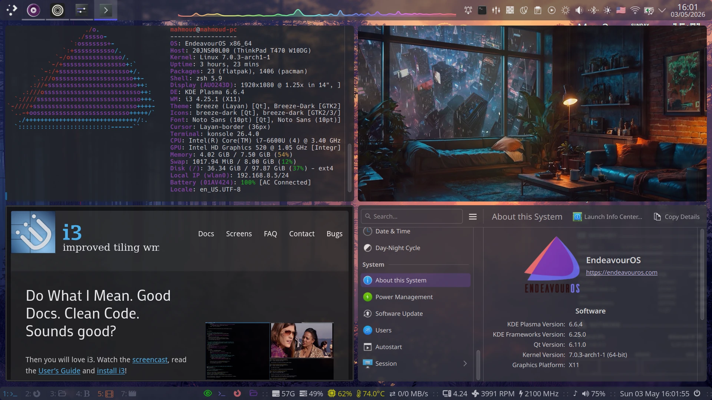
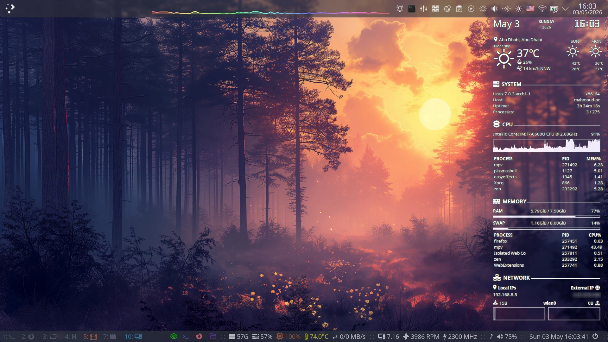
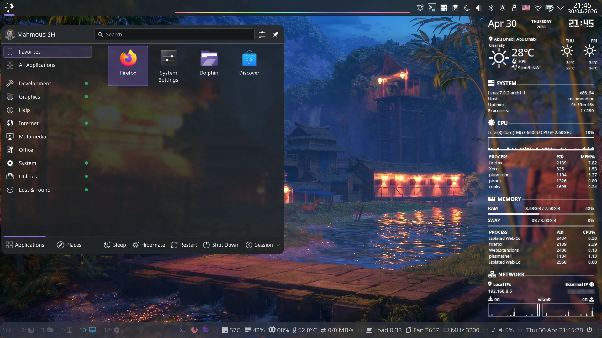
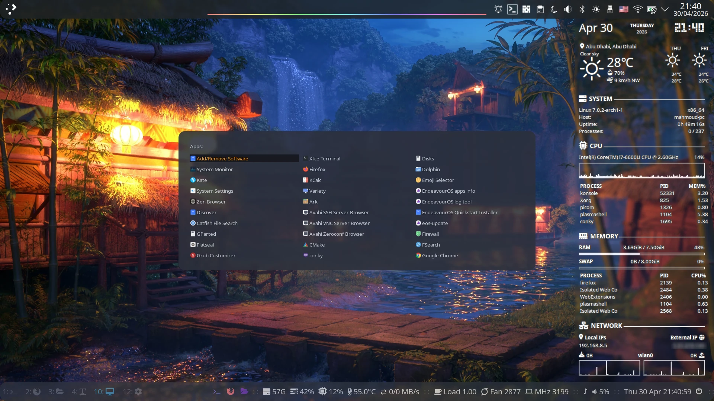
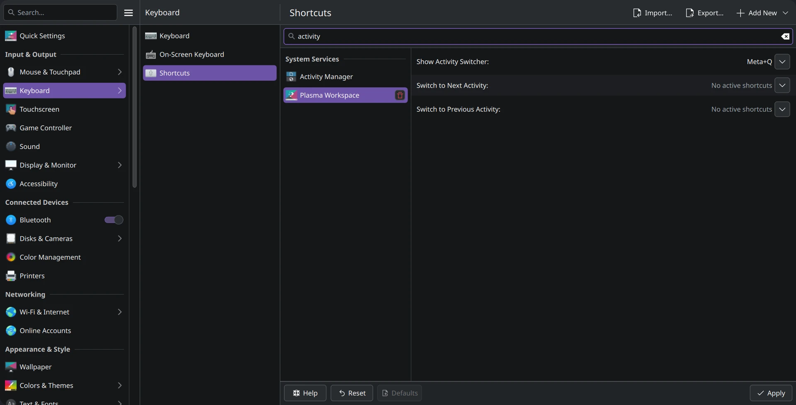
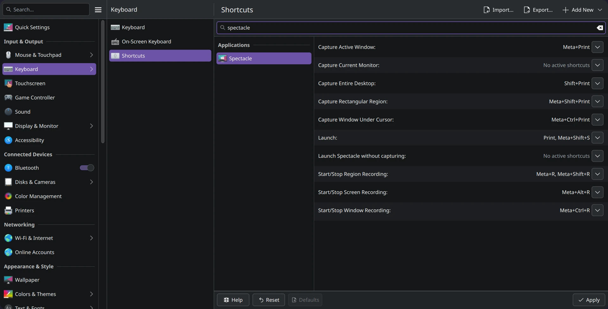
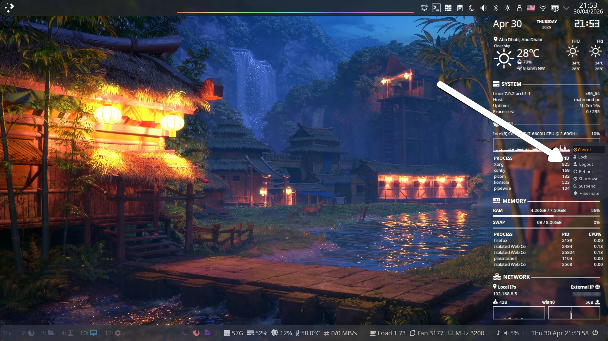
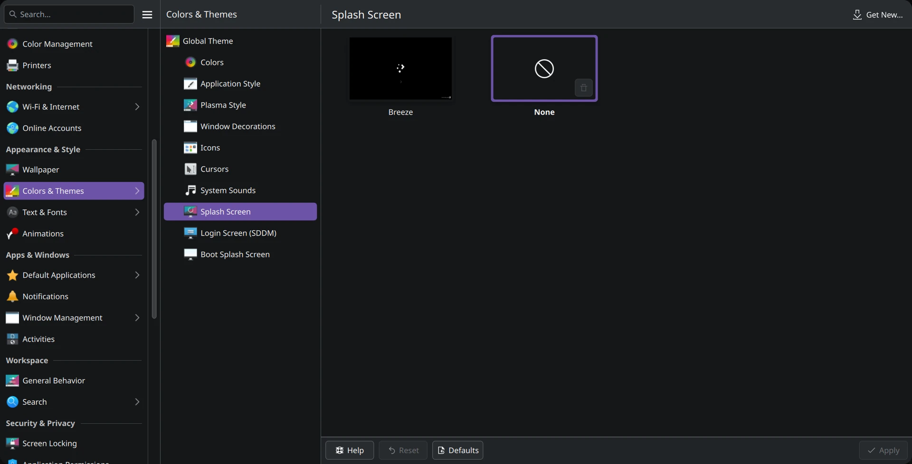
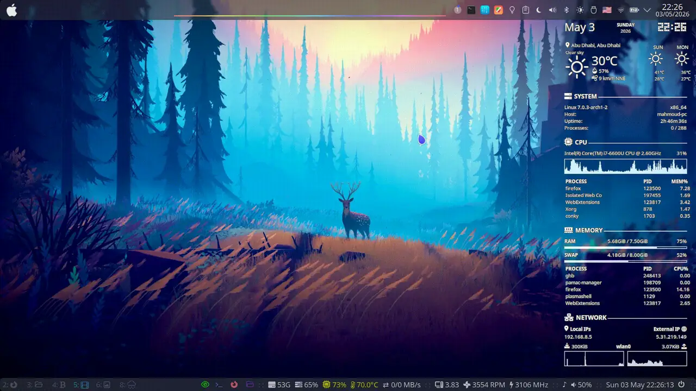
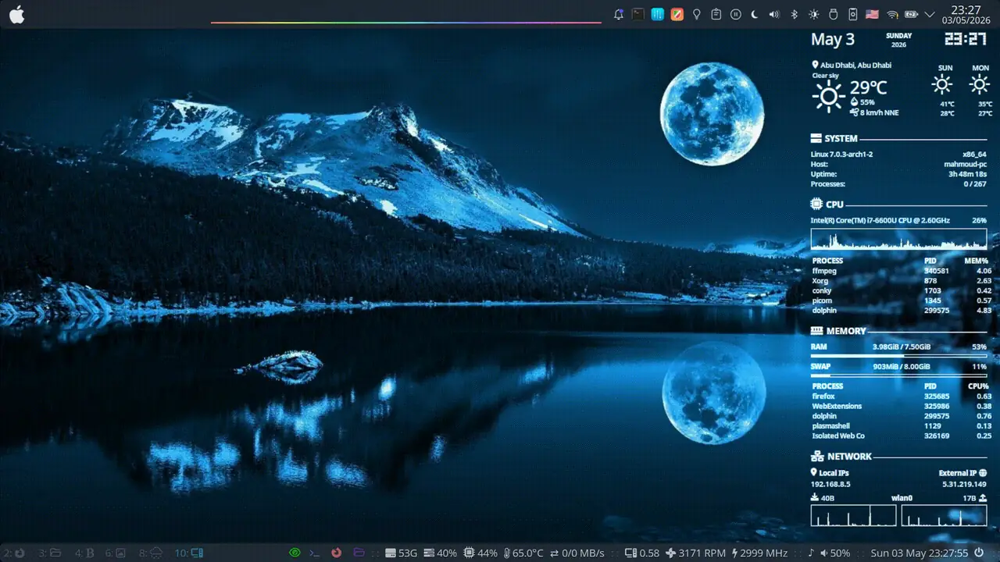

# i3 and KDE Plasma

<h3 align="center">The Best of Both Worlds</h3>
A comprehensive guide to integrating the i3 tiling window manager seamlessly into KDE Plasma. Get the ultimate tiling workflow without sacrificing KDE's out-of-the-box utilities.

---

> 
> 

---

## Why i3 and KDE Plasma?

* KDE Plasma is one of the most full-featured and beautiful desktop environments.
* i3wm is one of the lightest, most customizable, and simplest window managers.
* Together, we combine an easy, out-of-the-box desktop environment (***KDE Plasma***) with a lightweight, fully customizable tiling window manager (***i3wm***).

---

## Why use i3wm instead of a KWin script?

Short answer: **I3wm is better and more stable than any kwin script I tried**, and I would be happy for someone to prove me wrong.

---

## Pros & Cons

* **Pros** :
    * If you used KDE Plasma and i3wm before, you will love having them together.
    * Tiling support for KDE Plasma.
    * Most utilities and configurations, for example, (***GTK & QT theme, Display brightness buttons, Audio buttons, ...etc***) will work out of the box.

* **Cons**:
    * Not even one. “*At least for me*.”

---

## Features

What this config adds on top of plain i3 + Plasma (`Super` = the Windows key):

| Feature | Keys | What it does |
|---|---|---|
| Color themes | `Super+F2` / `Super+Shift+F2` | Next theme / pick one in rofi. Recolors window tabs, i3bar, i3blocks, rofi and the cheat sheet at once. Ships with plasma-whitesur, catppuccin-mocha, nord, gruvbox-dark, tokyo-night, dracula. |
| Keybinding cheat sheet | `Super+F1` or the keyboard icon in i3blocks | A clean conky overlay generated from the i3 config itself, so it's always up to date. |
| Two power menus | `Super+Shift+E` / `Super+Ctrl+E` | Rofi menu (lock, logout, reboot, shutdown through Plasma's session manager) or Plasma's own logout screen. |
| Plasma panel control | `Super+U` / `Super+Shift+U` | Toggle the Plasma panel, or switch it to dock mode. Its state is shown in i3blocks. |
| Hot corners and screen edges | mouse | Push the pointer into a corner or edge to trigger actions ([Screen Edges](etc/skel/.config/i3/scripts2/Screen%20Edges/master_perimeter_control.sh)). |
| Extra mouse buttons | back / forward buttons | Previous workspace and a drop-down terminal ([.xbindkeysrc](etc/skel/.xbindkeysrc)). |
| Frosted, readable tabs | - | Tabs are slightly transparent with a blur behind them (picom), and unfocused tab text stays readable in every theme. |
| Arabic / RTL window titles | - | Titles always start left-to-right, so Arabic titles are centered and not cut off. |
| Keyboard-layout proof shortcuts | - | Bindings use keycodes, so they keep working when the Arabic (or any other) layout is active. |

---

## Table of Contents

<details><summary>Click to view</summary>

1. **[Introduction](https://github.com/mysh264/i3-and-KDE-Plasma#i3-and-kde-plasma)**
    * [Why i3 and KDE Plasma?](https://github.com/mysh264/i3-and-KDE-Plasma#why-i3-and-kde-plasma)
    * [i3wm vs. KWin Scripts](http://github.com/mysh264/i3-and-KDE-Plasma#why-use-i3wm-instead-of-a-kwin-script)
    * [Pros & Cons](https://github.com/mysh264/i3-and-KDE-Plasma#pros--cons)
    * [Features](https://github.com/mysh264/i3-and-KDE-Plasma#features)


2. **[Installation & Setup](https://github.com/mysh264/i3-and-KDE-Plasma#installation)**
    * [Pre-installation State](https://github.com/mysh264/i3-and-KDE-Plasma#situation-before-the-installation)
    * [Clone This Repo (Recommended)](https://github.com/mysh264/i3-and-KDE-Plasma#clone-this-repo-prepared-for-kde-plasma--i3wm-recommended)
    * [EndeavourOS i3wm Base Setup](https://github.com/mysh264/i3-and-KDE-Plasma#or-clone-endeavouros-i3wm-setup)
    * [Packages (Required & Optional)](https://github.com/mysh264/i3-and-KDE-Plasma#packages)


3. **[Configuration](https://github.com/mysh264/i3-and-KDE-Plasma#configuration)**
    * [Replace kwin with i3 using systemd user service](https://github.com/mysh264/i3-and-KDE-Plasma#replace-kwin-with-i3-using-systemd-user-service)
    * [Troubleshooting / Recovery](https://github.com/mysh264/i3-and-KDE-Plasma#troubleshooting--recovery)
    * [i3 Config: Plasma Compatibility](https://github.com/mysh264/i3-and-KDE-Plasma#adding-stuff-to-the-i3-config)
    * [i3 Config: Cleanup & Optimization](https://github.com/mysh264/i3-and-KDE-Plasma#removing-stuff-from-the-i3-config)


4. **Desktop Fixes & Optimization**
    * [Keyboard Shortcut Conflicts](https://github.com/mysh264/i3-and-KDE-Plasma#disabling-a-shortcut-that-breaks-stuff)
    * [Logout: Two Options](https://github.com/mysh264/i3-and-KDE-Plasma#logout-two-options)
    * [Splash Screen](https://github.com/mysh264/i3-and-KDE-Plasma#disable-the-kde-plasma-startup-screen-splash-screen)
    * [Fixing Mouse Cursors (System & Flatpak)](https://github.com/mysh264/i3-and-KDE-Plasma#fix-mouse-cursor)
    * [Fixing i3bar & Frame Fonts](https://github.com/mysh264/i3-and-KDE-Plasma#fix-fonts-i3bar--i3-frame)
    * [Redshift & Geoclue Fix](https://github.com/mysh264/i3-and-KDE-Plasma#redshift-fix-geoclue)


5. **Workflow Enhancements**
    * [Toggle/Hide Plasma Panel Script](https://github.com/mysh264/i3-and-KDE-Plasma#toggle-hide-plasma-panel)
    * [Random Wallpapers (Feh)](https://github.com/mysh264/i3-and-KDE-Plasma#random-wallpapers-feh)
    * [Picom](https://github.com/mysh264/i3-and-KDE-Plasma#picom)
    * [i3blocks](https://github.com/mysh264/i3-and-KDE-Plasma#i3blocks)
    * [Color Themes](https://github.com/mysh264/i3-and-KDE-Plasma#color-themes)
    * [Rofi](https://github.com/mysh264/i3-and-KDE-Plasma#rofi-application-launcher-theme)


6. **[System Customization](https://github.com/mysh264/i3-and-KDE-Plasma#system-customization)**
    * [Shell (ZSH & Oh My Zsh)](https://github.com/mysh264/i3-and-KDE-Plasma#shell)
    * Themes
        * [KDE Themes](https://github.com/mysh264/i3-and-KDE-Plasma#kde-themes)
        * [Icons](https://github.com/mysh264/i3-and-KDE-Plasma#icons)
        * [Mouse Cursor Themes](https://github.com/mysh264/i3-and-KDE-Plasma#mouse-cursor-themes)
    * [Conky Setup](https://github.com/mysh264/i3-and-KDE-Plasma#conky)
    * [Grub](https://github.com/mysh264/i3-and-KDE-Plasma#grub-theme)
    * [Plymouth](https://github.com/mysh264/i3-and-KDE-Plasma#plymouth)
    * [Easy Effects Audio Presets](https://github.com/mysh264/i3-and-KDE-Plasma#easy-effects-presets)


7. **[App Recommendations](docs/APPS.md)**
    * [Terminals](docs/APPS.md#terminals)
    * [Web Browsers](docs/APPS.md#web-browsers)
    * [Email Clients](docs/APPS.md#email-clients)
    * [Editors](docs/APPS.md#editors)
    * [Downloader](docs/APPS.md#downloader)
    * [Torrent](docs/APPS.md#torrent-downloaders)
    * [Multimedia & Creative](docs/APPS.md#multimedia-tools)
    * [Screenshot & Recording](docs/APPS.md#screenshot--screen-recorder-tools)
    * [Disk Utilities](docs/APPS.md#disk-utilities)
    * [Password Managers](docs/APPS.md#password-managers)
    * [Network](docs/APPS.md#networking)
    * [Communication & Productivity](docs/APPS.md#communication-and-productivity)

</details>

---

<h2 align="center">Installation</h2>

### Situation before the installation

* EndeavourOS KDE Edition, all updates installed
* KDE Plasma (X11)
* KWin

---

### Clone This Repo *"Prepared for KDE Plasma + i3wm"* *Recommended*

#### [mysh264/i3-and-KDE-Plasma/etc/skel/](https://github.com/mysh264/i3-and-KDE-Plasma/tree/main/etc/skel)

**Option A: copy the files** (simple, your copies are independent from the repo)

```bash
git clone https://github.com/mysh264/i3-and-KDE-Plasma.git
cd i3-and-KDE-Plasma
cp -dvr etc/skel/. $HOME
```

**Option B: symlink the files** (what I use: editing a live config edits the repo, so `git pull` / `git diff` just work)

```bash
git clone https://github.com/mysh264/i3-and-KDE-Plasma.git
cd i3-and-KDE-Plasma
./link.sh -n   # dry run, prints what would happen
./link.sh      # anything already in the way is moved to ~/.dotfiles-backup-<date>/
```

After either option, apply a color theme once so every generated file matches:

```bash
~/.config/i3/scripts/theme-switch --apply
```

##### Tree Map ```i3-and-KDE-Plasma/etc/skel/```
<details>
  <summary>Click to expand!</summary>

```tree
.
├── .config
│   ├── conky
│   │   └── *lean-conky-config-0.9.0          # system monitor (edited for Plasma + i3wm)
│   ├── i3
│   │   ├── *config                           # main i3 config (Plasma compatibility, keys, rules)
│   │   ├── *i3blocks.conf.in                 # i3blocks TEMPLATE, edit this one (@ROLE@ colors)
│   │   ├── i3blocks.conf                     # GENERATED from the template by theme-switch
│   │   ├── i3blocks.extra.conf               # optional / unused blocks, kept for reference
│   │   ├── *themes/                          # color themes (plasma-whitesur, catppuccin, nord, ...)
│   │   ├── theme/                            # GENERATED: active theme (current.sh, i3-colors.conf)
│   │   ├── *conky-keyhint/keyhint.conf       # keybinding cheat sheet (conky template)
│   │   ├── scripts
│   │   │   ├── *theme-switch                 # switch / pick color themes
│   │   │   ├── *keyhint-gen, keyhint-toggle  # build and toggle the cheat sheet
│   │   │   ├── *keyhint-block                # i3blocks button for the cheat sheet
│   │   │   ├── *powermenu                    # rofi power menu (Plasma-aware logout/reboot/shutdown)
│   │   │   ├── cpu_usage, memory, disk, temperature, volume, bandwidth2, empty_workspace
│   │   │   └── _archive/                     # unused EndeavourOS scripts, kept for reference
│   │   └── *scripts2
│   │       ├── KDE Plasma
│   │       │   ├── plasma-i3-orchestrator.sh # places Plasma popups / notifications under i3
│   │       │   ├── id.sh                     # find X window ids by class / type / name
│   │       │   └── plasma_panel/             # Plasma panel toggle, ghost mode, dock, i3blocks status
│   │       ├── Screen Edges
│   │       │   ├── master_perimeter_control.sh  # hot corners and screen edges
│   │       │   └── i3bar_status.sh
│   │       ├── Server/server_stats.sh        # home server status block (needs server.conf)
│   │       ├── Workspace/track_workspaces.sh # "previous workspace" block
│   │       ├── fehbg.sh                      # random wallpapers (feh)
│   │       ├── ip_country.sh                 # public IP / country block
│   │       └── restart_perimeter.sh
│   ├── nano
│   │   └── nanorc
│   ├── picom
│   │   └── *picom.conf                       # compositor: frosted tabs, rounded corners, fading
│   ├── rofi
│   │   ├── config.rasi                       # launcher (imports theme-colors.rasi)
│   │   ├── theme-colors.rasi                 # GENERATED by theme-switch
│   │   ├── powermenu.rasi, power-profiles.rasi, rofidmenu.rasi, rofikeyhint.rasi
│   ├── systemd
│   │   └── user
│   │       └── *plasma-i3.service            # runs i3 instead of KWin inside Plasma
│   ├── viewnior
│   └── yazi                                  # terminal file manager + plugins
├── .icons
│   ├── default
│   │   └── *index.theme                      # default cursor theme
│   ├── Layan-border-cursors
│   └── material_cursors
├── .local
│   └── share
│       ├── applications                      # yazi / kitty yt-x launchers
│       ├── *easyeffects/output               # GentleDynamics audio presets
│       └── rofi/themes                       # rofi color themes
├── .xbindkeysrc                              # extra mouse buttons (back_and_forth, drop-down terminal)
├── .Xresources                               # font rendering for i3bar / i3 frames
└── .zshrc                                    # zsh + oh-my-zsh (private bits go in ~/.zshrc.local)
```
</details>

---

### Or Clone [EndeavourOS i3wm Setup](https://github.com/endeavouros-team/endeavouros-i3wm-setup)

#### [endeavouros-team/endeavouros-i3wm-setup/etc/skel/](https://github.com/endeavouros-team/endeavouros-i3wm-setup/tree/main/etc/skel)

```bash
git clone https://github.com/endeavouros-team/endeavouros-i3wm-setup.git
cd endeavouros-i3wm-setup/etc/skel/
```

##### Tree Map ```endeavouros-i3wm-setup/etc/skel/```
<details>
  <summary>Click to expand!</summary>

```tree
.
├── .config
│   ├── autostart
│   │   └── firewall-applet.desktop
│   ├── dunst
│   │   └── dunstrc
│   ├── example.picom.conf
│   ├── gtk-3.0
│   │   ├── gtk.css
│   │   └── settings.ini
│   ├── gtk-4.0
│   │   └── settings.ini
│   ├── i3
│   │   ├── config
│   │   ├── i3blocks.conf
│   │   ├── keybindings
│   │   └── scripts
│   │       ├── audio-device-switch
│   │       ├── bandwidth2
│   │       ├── battery
│   │       ├── battery-pinebook-pro
│   │       ├── blur-lock
│   │       ├── cputemp
│   │       ├── cpu_usage
│   │       ├── disk
│   │       ├── empty_workspace
│   │       ├── gputemp
│   │       ├── import-gsettings
│   │       ├── keyhint
│   │       ├── keyhint-2
│   │       ├── memory
│   │       ├── openweather
│   │       ├── powermenu
│   │       ├── power-profiles
│   │       ├── ppd-status
│   │       ├── temperature
│   │       ├── volume
│   │       ├── volume_brightness2.sh
│   │       ├── volume_brightness.sh
│   │       └── vpn
│   ├── nano
│   │   └── nanorc
│   ├── nwg-look
│   │   └── config
│   ├── rofi
│   │   ├── config.rasi
│   │   ├── powermenu.rasi
│   │   ├── power-profiles.rasi
│   │   ├── rofidmenu.rasi
│   │   └── rofikeyhint.rasi
│   ├── xfce4
│   │   └── xfconf
│   │       └── xfce-perchannel-xml
│   │           └── xfce4-terminal.xml
│   └── xsettingsd
│       └── xsettingsd.conf
├── .gtkrc-2.0
├── .icons
│   └── default
│       └── index.theme
├── .local
│   └── share
│       ├── nwg-look
│       │   └── gsettings
│       └── rofi
│           └── themes
│               ├── arc_dark_colors.rasi
│               ├── arc_dark_transparent_colors.rasi
│               └── deep-purple.rasi
├── .profile
├── set_once.sh
├── tree.txt
├── xed.dconf
└── .Xresources
```
</details>

---

### Packages

We're gonna install a couple of packages that are required or nice-to-haves on i3, as well as i3 itself. This consists of:

* ```i3``` , [the window manager itself](https://i3wm.org/)
* ```i3blocks``` , [for i3bar status line](https://github.com/vivien/i3blocks)
* ```picom``` , [compositor](https://github.com/yshui/picom) (kwin replacement)
* ```feh``` , [to set up the background](https://github.com/derf/feh)
* ```rofi``` , [application launcher](https://github.com/davatorium/rofi) (dmenu replacement)
* ```wmctrl``` , [to get some info for the i3 config](https://github.com/Conservatory/wmctrl) (if you're not on an English installation of Plasma)

*optional for i3wm*

* ```viewnior``` , My favorite [image viewer](https://github.com/hellosiyan/Viewnior) (gwenview alternative)
* ```conky``` , [light-weight system monitor](https://github.com/brndnmtthws/conky)
* ```redshift``` , Color temperature adjustment tool <sup>[Geoclue fix](https://github.com/mysh264/i3-and-KDE-Plasma#redshift-fix-geoclue)</Sup>
* ```awesome-terminal-fonts otf-font-awesome``` , if you are using [awesome fonts](https://fontawesome.com/v4/cheatsheet/) , you will need it
* ```xfce4-terminal``` , [best drop-down terminal](https://docs.xfce.org/apps/xfce4-terminal/dropdown) (yakuake replacement)
* ```sysstat tk gnuplot``` , some i3blocks scripts need them

*optional for KDE Plasma Panel*

* ```xdotool xorg-xwininfo``` to hide plasma panel
* ```plasma-applet-window-buttons``` <sup>[Extra](https://archlinux.org/packages/extra/x86_64/plasma-applet-window-buttons/)</sup> , [This is a Plasma 6 applet that shows window buttons in your panels](https://github.com/moodyhunter/applet-window-buttons6)
* ```plasma6-applets-panel-spacer-extended``` <sup>[AUR](https://aur.archlinux.org/packages/plasma6-applets-panel-spacer-extended)</sup> , [Spacer with Mouse gestures for the KDE Plasma Panel](https://github.com/luisbocanegra/plasma-panel-spacer-extended)
* ```plasma6-applets-kurve```  <sup>[AUR](https://aur.archlinux.org/packages/plasma6-applets-kurve)</sup> , [Audio visualizer widget powered by CAVA for the KDE Plasma Desktop](https://github.com/luisbocanegra/kurve)

**Here's a one-liner on how I installed everything needed:**
```bash
sudo pacman -Syyu && sudo pacman -S i3 i3blocks picom feh rofi wmctrl
```

Another one for ***i3wm optional Packages***:
```bash
sudo pacman -S viewnior conky redshift awesome-terminal-fonts otf-font-awesome xfce4-terminal sysstat tk gnuplot
```

A third one for ***KDE Plasma panel optional Packages***:
```bash
sudo pacman -S xdotool xorg-xwininfo plasma-applet-window-buttons
```

```bash
yay -S plasma6-applets-panel-spacer-extended plasma6-applets-kurve
```

---

<h2 align="center">Configuration</h2>

### Replace kwin with i3 using systemd user service

***Note1: For this method, you do not need to be the root user.***
***Note2: Changes made with this method only affect the current user.***

Create a new service file called plasma-i3.service in `$HOME/.config/systemd/user`.

```bash
mkdir -p $HOME/.config/systemd/user
```

```bash
cd $HOME/.config/systemd/user
```

```bash
nano plasma-i3.service
```

Write the following into `$HOME/.config/systemd/user/plasma-i3.service`:

```conf
[Unit]
Description=Launch Plasma with i3
Before=plasma-workspace.target

[Service]
ExecStart=/usr/bin/i3
Restart=on-failure

[Install]
WantedBy=plasma-workspace.target
```

Reload Systemd Daemon
```bash
systemctl --user daemon-reload
```

Mask `plasma-kwin_x11.service` by running
```bash
systemctl mask plasma-kwin_x11.service --user
```

Enable the plasma-i3 service by running
```bash
systemctl enable plasma-i3 --user
```

To go back to KWin, just unmask the `plasma-kwin_x11.service` and disable your `plasma-i3` service in the same way.
```bash
systemctl unmask plasma-kwin_x11.service --user
```
```bash
systemctl disable plasma-i3 --user
```

### Troubleshooting / Recovery
> [!CAUTION]
> **RECOVERY MODE:** If your screen goes black or the service fails, press **Ctrl+Alt+F3**, log in, and run the commands below.

```bash
systemctl unmask plasma-kwin_x11.service --user
```

```bash
systemctl disable plasma-i3 --user
```

```bash
reboot
```
---


### Adding stuff to the i3 config

1. To improve compatibility with Plasma, add the following lines in your i3 config.

```conf
# Plasma compatibility improvements

for_window [window_role="pop-up"] floating enable
for_window [window_role="task_dialog"] floating enable
for_window [class="yakuake"] floating enable
for_window [class="systemsettings"] floating enable
for_window [class="plasmashell"] floating enable
for_window [class="Plasma"] floating enable, border none
for_window [title="plasma-desktop"] floating enable, border none
for_window [title="win7"] floating enable, border none
for_window [class="krunner"] floating enable, border none
for_window [class="Kmix"] floating enable, border none
for_window [class="Klipper"] floating enable, border none
for_window [class="Plasmoidviewer"] floating enable, border none
for_window [class="(?i)*nextcloud*"] floating disable


no_focus [class="plasmashell" window_type="notification"]


for_window [class="plasmashell" window_type="notification"] floating enable, border none, move absolute position center, move down 400px

# Killing the existing window that covers everything
for_window [title="^Desktop @ QRect.*"] kill, floating enable, border none
```

2. For the application launcher, you can still use the application launcher from Plasma Panel.

> <p align="center">"KDE Plasma application launcher"</p>

> 

Also, you can use `rofi` launcher. *Meta+E*

> <p align="center">"Rofi application launcher"</p>

> 

If you prefer to use `krunner`, this is the terminal command line to launch it, if you need it.
```bash
qdbus6 org.kde.krunner /App org.kde.krunner.App.display
```

---

### Removing stuff from the i3 config
1. **Startup apps**
* _KDE Plasma will handle the startup apps._ Remove any ```exec``` line that is used for auto startup in the i3 config file; also, do not use ```dex```, the only exception will be feh for wallpaper, picom and [conky](https://github.com/brndnmtthws/conky) <sup>[conky theme](https://github.com/jxai/lean-conky-config)</sup>.
```
exec --no-startup-id feh --bg-scale "/path/to/wallpaper"
```
More info about picom [down below](https://github.com/mysh264/i3-and-KDE-Plasma#picom).
```
exec --no-startup-id picom -b
```

2. **Notifications**

* _KDE Plasma will handle it out of the box._

3. **Keyboard Layout**

* _KDE Plasma will handle it out of the box._ Remove any shortcut for that from the i3wm config file.
* Or Keep it if you prefer.
  ```bash
  exec --no-startup-id setxkbmap -layout 'us,ara' -variant altgr-intl,qwerty -option 'grp:win_space_toggle'
  ```

4. **Display brightness buttons integration**

* _KDE Plasma will handle it out of the box._ Remove any shortcut for that from the i3wm config file.

5. **Audio buttons integration**

* _KDE Plasma will handle it out of the box._ Remove any shortcut for that from the i3wm config file.

6. **Lock screen**

* _KDE Plasma will handle it out of the box._ Remove any shortcut for that from the i3wm config file.
* *Note: This is the terminal command line to lock the screen, if you need it.* ```loginctl lock-session```

7. **Tray applet**

* _KDE Plasma will handle it out of the box._
* *Note: Make sure to add ```tray_output none``` to your i3 bar { } section in your i3 config file.*

---

### Disabling a shortcut that breaks stuff

#### Meta+Q "*Kill apps*"
Launch the Plasma System Settings and go to *Keyboard > Shortcuts > Category System Services > Plasma Workspace* and disable the shortcut "Activities..." that uses the combination ```Meta+Q```.

> <p align="center">"Screenshot of Activities Shortcut Settings"</p>

> 

#### Meta+R "*Resize*"
Launch the Plasma System Settings and go to *Category Workspace > Shortcuts > Category Applications > Spectacle* and disable the shortcut "Start/Stop Region Recording" that uses the combination ```Meta+R```.

> <p align="center">"Screenshot of Spectacle Shortcut Settings"</p>

> 

---

### Logout: two options
Under i3 the Plasma logout screen used to open as a small broken window. With the rule below it opens fullscreen and works normally, so you can use either menu:

* **`Super+Shift+E`: rofi power menu** ([powermenu](etc/skel/.config/i3/scripts/powermenu)). Quick keyboard menu: lock, logout, reboot, shutdown. Logout, reboot and shutdown go through Plasma's session manager (`qdbus6 org.kde.Shutdown`), so apps are closed cleanly and the session is saved.
* **`Super+Ctrl+E`: Plasma's own logout screen**, the familiar full-screen KDE one.

```
# rofi power menu
$code $mod+Shift+$e $exec ~/.config/i3/scripts/powermenu
# Plasma logout screen
$code $mod+Ctrl+$e $exec qdbus6 org.kde.LogoutPrompt /LogoutPrompt org.kde.LogoutPrompt.promptAll
# make the Plasma logout screen cover the whole screen
for_window [class="ksmserver-logout-greeter"] fullscreen enable, border none
```

> <p align="center">"Rofi exit menu"</p>

> 

---

### Disable the KDE Plasma startup screen "*Splash Screen*"
Launch the Plasma System Settings and go to *Colors & Themes > Splash Screen* and disable it.

> <p align="center">"Screenshot of Splash Screen Settings"</p>

> 

-----

### Fix mouse cursor

When changing the mouse cursor theme or size, some apps may display a different cursor.
In my case, I used [Layan border cursors](https://github.com/vinceliuice/Layan-cursors) <sup>[KDE Store](https://store.kde.org/p/1365214)</sup> and changed the size to 36.

To fix it, create the `$HOME/.icons/default` directory. ***If it doesn't exist.***

```bash
mkdir -p $HOME/.icons/default
```

Then edit/create a new file called `index.theme`

```bash
nano $HOME/.icons/default/index.theme
```

Write the following into `index.theme`

```conf
[Icon Theme]
Name=layan-border-cursors
Size=36
```

#### For Flatpak apps, the problem is still the same; to fix it you need to give read access to ```/usr/share/icons/``` ```/home/$USER/.icons/``` ```/.local/share/icons/``` <sup>[Arch Wiki](https://wiki.archlinux.org/title/Flatpak#Applications_do_not_use_the_correct_cursor_theme)</sup>

```bash
flatpak -u override --filesystem=/usr/share/icons/:ro
```

```bash
flatpak -u override --filesystem=/home/$USER/.icons/:ro
```

```bash
flatpak --user override --filesystem=~/.local/share/icons/:ro
```

```bash
flatpak -u override --filesystem=xdg-config/gtk-3.0:ro
```

---

### Fix Fonts (**i3bar & i3-frame**)
When you restart the system, the i3bar uses a different font. Restarting i3 in place using ```Super+Shift+R``` solves it.
I know this is frustrating, so here is another workaround/solution.

Create a new file called `.Xresources` in your $HOME

```bash
nano $HOME/.Xresources
```

Write the following into `.Xresources`

```conf
Xft.antialias: 1
Xft.hinting: 1
Xft.hintstyle: hintslight
Xft.rgba: rgb
```

Then run this to load parameters from your configuration file `.Xresources` during your X Session.

```bash
xrdb -merge ~/.Xresources
```
To check run

```bash
xrdb -query -all
```

Finally, add these lines to your i3 config file to load the parameters and restart i3 at the start up.

``` conf
# Load ~/.Xresources
exec --no-startup-id xrdb -merge ~/.Xresources

# Restart i3wm
no-startup-id sleep 2 && i3-msg restart
```

---

### Redshift fix *(geoclue)*

If you tried to run redshift, the first thing you will notice is it can't locate your location, all that is required is **start Geoclue Demo agent.**

```bash
/usr/lib/geoclue-2.0/demos/agent &
```

*check if GeoClue works properly*

```bash
/usr/lib/geoclue-2.0/demos/where-am-i
```

```bash
systemctl status geoclue.service
```

---

### Toggle Hide Plasma Panel

i3wm can't auto-hide or toggle the Plasma panel, and most of the time I don't need it, so these scripts (using `xdotool` and `xorg-xwininfo`) take care of it.



**Keys**
* `Super+U`: show / hide the panel
* `Super+Shift+U`: switch between dock mode (the panel reserves space) and ghost mode (floats above windows)
* `Super+Shift+P`: restart the panel if it gets stuck

**How it works**
* The panel shares the `plasmashell` class with notifications and popups, so at login [panel-startup.sh](etc/skel/.config/i3/scripts2/KDE%20Plasma/plasma_panel/panel-startup.sh) finds the panel window and gives it a unique name (`Togglehidepanelplasma`). [panel-name.sh](etc/skel/.config/i3/scripts2/KDE%20Plasma/plasma_panel/panel-name.sh) is how every other script finds it again.
* [panel_toggle.sh](etc/skel/.config/i3/scripts2/KDE%20Plasma/plasma_panel/panel_toggle.sh) uses [panel_hide.sh](etc/skel/.config/i3/scripts2/KDE%20Plasma/plasma_panel/panel_hide.sh) and [panel_show.sh](etc/skel/.config/i3/scripts2/KDE%20Plasma/plasma_panel/panel_show.sh). [panel_dock_toggle.sh](etc/skel/.config/i3/scripts2/KDE%20Plasma/plasma_panel/panel_dock_toggle.sh) and [panel_ghost_mode.sh](etc/skel/.config/i3/scripts2/KDE%20Plasma/plasma_panel/panel_ghost_mode.sh) switch the mode, and [panel_restart.sh](etc/skel/.config/i3/scripts2/KDE%20Plasma/plasma_panel/panel_restart.sh) restarts plasmashell.
* [panel_i3blocks.sh](etc/skel/.config/i3/scripts2/KDE%20Plasma/plasma_panel/panel_i3blocks.sh) shows the panel state in i3blocks, in the active theme's colors. It updates when the other scripts send `pkill -RTMIN+2 i3blocks`.

**Requirements**

```bash
sudo pacman -S xdotool xorg-xwininfo
```

***Note: the scripts assume the panel is at the top of the screen. If yours is at the bottom, check the coordinates in the scripts first.***

The i3 config and i3blocks lines are already in this repo ([config](etc/skel/.config/i3/config), [i3blocks.conf.in](etc/skel/.config/i3/i3blocks.conf.in)):

```conf
# i3 config
$exec "$HOME/.config/i3/scripts2/'KDE Plasma'/plasma_panel/panel-startup.sh"
$code $mod+$u $exec ~/.config/i3/scripts2/'KDE Plasma'/plasma_panel/panel_toggle.sh && pkill -RTMIN+2 i3blocks
```

```ini
# i3blocks.conf.in
[plasma-panel]
command=~/.config/i3/scripts2/'KDE Plasma'/plasma_panel/panel_i3blocks.sh
interval=once
signal=2
```

---

### Random wallpapers (Feh)



1. Copy the scripts2 folder to your i3 config directory

```bash
git clone https://github.com/mysh264/i3-and-KDE-Plasma.git
cd i3-and-KDE-Plasma
cp -dvr etc/skel/.config/i3/scripts2/ $HOME/.config/i3/
```

2. Make Wallpaper directory ```$HOME/.Wallpapers``` , ***Note: This directory will be used for feh script, move/ln/copy your wallpapers folders/Images to this folder***

```
mkdir ~/.Wallpapers
```

3. Add this line to your i3 config file to startup the scripts ```fehbg.sh```

```
exec --no-startup-id ~/.config/i3/scripts2/fehbg.sh -t 300 # -t means sleep time (300 = 5 min)
```

<details>
  <summary>Click to view fehbg.sh</summary>

```sh
#!/bin/bash

walldir=$HOME/.Wallpapers/*
app=feh
scale=--bg-fill
options="--randomize --recursive"

# Default values
SLEEP_TIME=300 # 5 min

# ':' after a letter means that option requires an argument
while getopts "t:" opt; do
  case $opt in
    t)
      SLEEP_TIME=$OPTARG
      ;;
    \?)
      echo "Invalid option: -$OPTARG" >&2
      exit 1
      ;;
  esac
done

while $app $options $scale $walldir;
do sleep $SLEEP_TIME;
done
```
</details>

---

### Picom

My config: [picom.conf](etc/skel/.config/picom/picom.conf) (glx backend, vsync, fading, rounded corners). What matters for i3:

* **Frosted tabs.** i3's title bars (`i3-frame`) are 85% opaque with a blur behind them, so the wallpaper shows through but the text stays sharp. Blur is turned on only for the tabs and i3bar; normal windows are not blurred.

```conf
frame-opacity = 0.85;
opacity-rule = [ "85:class_g = 'i3-frame'", "70:class_g = 'i3bar'", ... ];
blur: { method = "dual_kawase"; strength = 2; background = true; background-frame = true; ... }
blur-background-exclude = [ "!(class_g = 'i3-frame' || class_g = 'i3bar')", ... ];
```

* Tune it with the `85` / `0.85` pair (lower = more glass) and the blur `strength`.
* Unfocused windows are dimmed (`inactive-dim = 0.2`); the cheat sheet is excluded, so it always stays bright.
* Picom does not reload its config on its own. Restart it after editing: `pkill -x picom; picom --config ~/.config/picom/picom.conf &`.

https://wiki.archlinux.org/title/Picom

---

### I3blocks

* **Edit the template, not the output.** [i3blocks.conf.in](etc/skel/.config/i3/i3blocks.conf.in) is the source; colors are written as `@ROLE@` placeholders (for example `color=@OK@`). `theme-switch` fills them in and writes [i3blocks.conf](etc/skel/.config/i3/i3blocks.conf). After editing the template, run `~/.config/i3/scripts/theme-switch --apply`.
* Blocks you don't use are kept in [i3blocks.extra.conf](etc/skel/.config/i3/i3blocks.extra.conf); copy one back into the template to enable it.
* Scripts: [scripts](etc/skel/.config/i3/scripts) (system blocks, based on EndeavourOS) and [scripts2](etc/skel/.config/i3/scripts2) (my own: Plasma panel, server, IP, workspaces).
* Threshold colors (disk, memory, CPU, temperature) come from the theme through the `WARN_COLOR` / `CRIT_COLOR` variables.
* Signals, to refresh a block from a script: `pkill -RTMIN+<n> i3blocks`

| Signal | Block |
|---|---|
| 1 | previous workspace |
| 2 | Plasma panel state |
| 3 | cheat sheet button |
| 10 | public IP / country |

https://github.com/vivien/i3blocks

---

### Color Themes

`Super+F2` switches to the next theme, and `Super+Shift+F2` opens a rofi picker. You can also run [theme-switch](etc/skel/.config/i3/scripts/theme-switch) by hand: `theme-switch --list`, `theme-switch nord`, `theme-switch --apply` (re-apply the current theme).

One theme recolors everything: window tabs and borders, i3bar, i3blocks, rofi and the cheat sheet.

**Make your own theme**: copy a file in [themes/](etc/skel/.config/i3/themes) and edit the colors. Every theme defines the same roles:

```sh
NAME="My Theme"
BG="#2b2b2b"          # bar and unfocused tab background
SURFACE="#424242"     # raised surfaces, tab borders
FG="#fcfcfc"          # main text
MUTED="#a0a0a0"       # secondary text
SEP="#5c5c5c"         # separators
ACCENT="#926ee4"      # focused window, active workspace
ACCENT_DIM="#7157aa"  # focused tab background
ACCENT_FG="#fcfcfc"   # text on the accent colors
OK="#27ae60"  WARN="#f67400"  CRIT="#da4453"  INFO="#d1c7f2"
LAUNCH_TERM="#b39bf0" LAUNCH_WEB="#e5739b" LAUNCH_FILES="#5fa8d3"   # launcher icons in i3blocks
```

Then run `theme-switch my-theme` (the file name without `.theme`).

---

### Rofi *"Application Launcher"* Theme

1. Copy ```.config/rofi``` & ```.local/share/rofi``` to their respective locations in $HOME.

```bash
git clone https://github.com/mysh264/i3-and-KDE-Plasma.git
cd i3-and-KDE-Plasma
cp -dvr etc/skel/.config/rofi $HOME/.config/
cp -dvr etc/skel/.local/share/rofi $HOME/.local/share/
```


---


<h2 align="center">System Customization</h2>


### Shell

#### 1. Using ZSH instead of Bash, + OH MY ZSH

* ```zsh``` , A very advanced and programmable command interpreter (shell) for UNIX.

* ```fastfetch``` , Fastfetch is a neofetch-like tool for fetching system information and displaying it in a visually appealing way.

* ```zsh-autosuggestions``` , Brings Fish-shell autosuggestions to ZSH.

* ```zsh-history-substring-search``` , ZSH port of Fish history search (up arrow).

* ```zsh-syntax-highlighting``` , Fish-shell-like syntax highlighting for Zsh.

* ```oh-my-zsh-git``` <sup>[Github](https://github.com/ohmyzsh/ohmyzsh)</sup> <sup>[AUR](http://aur.archlinux.org/packages/oh-my-zsh-git)</sup> , A community-driven framework for managing your zsh configuration. Includes 180+ optional plugins and over 120 themes to spice up your morning, and an auto-update tool so that makes it easy to keep up with the latest updates from the community.

``````bash
sudo pacman -S zsh fastfetch zsh-autosuggestions zsh-history-substring-search zsh-syntax-highlighting
``````

```bash
yay -S oh-my-zsh-git
```

#### 2. Change user shell to ZSH

```bash
chsh -s $(which zsh)
```

#### 3. Edit ZSH config file

##### Optionally, Backup Your Existing ~/.zshrc File

```bash
cp ~/.zshrc ~/.zshrc.orig
```

##### Copy OH MY ZSH Configuration File

```bash
cp -v /usr/share/oh-my-zsh/zshrc $HOME/.zshrc
```

##### Edit ZSH config file:

```bash
nano .zshrc
```

Change ```ZSH_THEME=``` to [Bira](https://github.com/ohmyzsh/ohmyzsh/wiki/Themes#bira)

```conf
ZSH_THEME="bira"
```

Enable ```fastfetch``` , ```zsh-autosuggestions``` , ```zsh-history-substring-search``` , & ```zsh-syntax-highlighting``` , 

Add these lines to the very end of the file:

```conf
source /usr/share/zsh/plugins/zsh-autosuggestions/zsh-autosuggestions.zsh
source /usr/share/zsh/plugins/zsh-syntax-highlighting/zsh-syntax-highlighting.zsh
source /usr/share/zsh/plugins/zsh-history-substring-search/zsh-history-substring-search.zsh

fastfetch
```

##### Useful alias 

```bash
alias update-full="sudo pacman -Syyu --noconfirm ; yay -Syu --noconfirm ;  flatpak update --appstream && flatpak update --assumeyes"
alias update="sudo pacman -Syyu --noconfirm"
alias update-yay="yay -Syyu --noconfirm"
alias update-flatpak="flatpak update --appstream && flatpak update --assumeyes"
alias update-fonts="fc-cache -fv"
```

---

### KDE Themes

* [Layan kde](https://github.com/vinceliuice/Layan-kde) <sup>[AUR](http://aur.archlinux.org/packages/plasma6-themes-layan-git)</sup> , Layan kde is a flat Design theme for KDE Plasma desktop.

  ```bash
  yay -S plasma6-themes-layan-git
  ```

* [WhiteSur KDE Theme](https://github.com/vinceliuice/WhiteSur-kde) <sup>[AUR](http://aur.archlinux.org/packages/whitesur-kde-theme)</sup> , WhiteSur kde is a MacOS big sur like theme for KDE Plasma desktop.

  ```bash
  yay -S whitesur-kde-theme
  ```

---

### Icons

* [WhiteSur Icon Theme](https://github.com/vinceliuice/WhiteSur-icon-theme) <sup>[AUR](http://aur.archlinux.org/packages/whitesur-icon-theme)</sup> , MacOS Big Sur like icon theme for linux desktops.

  ```bash
  yay -S whitesur-icon-theme
  ```

---

### Mouse Cursor Themes

* [Layan border cursors](https://github.com/vinceliuice/Layan-cursors) <sup>[KDE Store](https://store.kde.org/p/1365214)</sup> , This is an x-cursor theme inspired by layan gtk theme and based on [capitaine-cursors](https://github.com/keeferrourke/capitaine-cursors).

* [Material Cursors](https://github.com/varlesh/material-cursors) <sup>[AUR](https://aur.archlinux.org/packages/material-cursors-git)</sup> <sup>[KDE Store](https://store.kde.org/p/1346778)</sup> , Material cursors with 3 color variants.

  ```bash
  yay -S material-cursors-git
  ```

---

### Conky

* [Lean Conky Config](https://github.com/jxai/lean-conky-config) , Lean Conky Config (LCC) is, well, a lean [Conky](https://github.com/brndnmtthws/conky/wiki) config that just works.

  


***Note: I edited conky.conf to make it work for plasma + i3wm***

```bash
git clone https://github.com/mysh264/i3-and-KDE-Plasma.git
```

```bash
cd i3-and-KDE-Plasma
```

```bash
cp -dvr etc/skel/.config/conky $HOME/.config/
```

Then add this line to your i3 config file to auto start conky.

```conf
exec --no-startup-id ~/.config/conky/lean-conky-config-0.9.0/start-lcc.sh
```

---

### Grub Theme

* [Distro Grub Themes](https://github.com/AdisonCavani/distro-grub-themes) <sup>[Themes](https://k1ng.dev/distro-grub-themes/preview)</sup> , A pack of GRUB2 themes for different Linux distributions and OSs.

* [Gorgeous-GRUB](https://github.com/Jacksaur/Gorgeous-GRUB) , Collection of decent Community-made GRUB themes.

* [Grub Customizer](https://launchpad.net/grub-customizer) <sup>[AUR](https://aur.archlinux.org/packages/grub-customizer)</sup> , A graphical grub2 settings manager.

  ```bash
  yay -S grub-customizer
  ```

---


### Plymouth

* https://wiki.archlinux.org/title/Plymouth

<!-- Section coming soon -->

---

### Easy Effects Presets

* [GentleDynamics](https://github.com/droidwayin/GentleDynamics)
  * [GentleDynamics Dialogue Clarity Engine (Movie Preset)](https://github.com/droidwayin/GentleDynamics#-gentledynamics-dialogue-clarity-engine-movie-preset-%EF%B8%8F) , This preset employs surgical compression techniques to solve the common  problem of fluctuating dialogue levels in modern movies without using  AutoGain. This preset ensures the dialogue is always clear, while  respecting the dynamics and impact of the original soundtrack. You get  consistent, ***intelligible speech***.
  * [GentleDynamics Feather Loudness V4 (Gentler and Sweeter Preset for Music](https://github.com/droidwayin/GentleDynamics#-gentledynamics-feather-loudness-v4-gentler-and-sweeter-preset-for-music-%EF%B8%8F%E2%80%8D) , This EasyEffects preset based on psychoacoustic principles to enhance  your music listening experience. It features an 8-band multiband  compressor (MBC) aligned with human hearing (Bark scale) for natural  sound improvement on both headphones and speakers.

* [Autoeq](https://www.autoeq.app/) , AutoEq is a tool for automatically equalizing headphones.

---

<h2 align="center">App Recommendations</h2>

My list of recommended apps (terminals, browsers, editors, multimedia, extensions, ...) lives in **[docs/APPS.md](docs/APPS.md)**.

More notes in [docs/](docs): [fingerprint login on HP laptops](docs/hp-fingerprint.md) and the [setup checklist](docs/TODO.md).

---

<h3 align="center">Found this useful?</h3>
<h3 align="center">Give it a ⭐ to help others find the best way to tile their KDE Plasma desktop!</h3>
